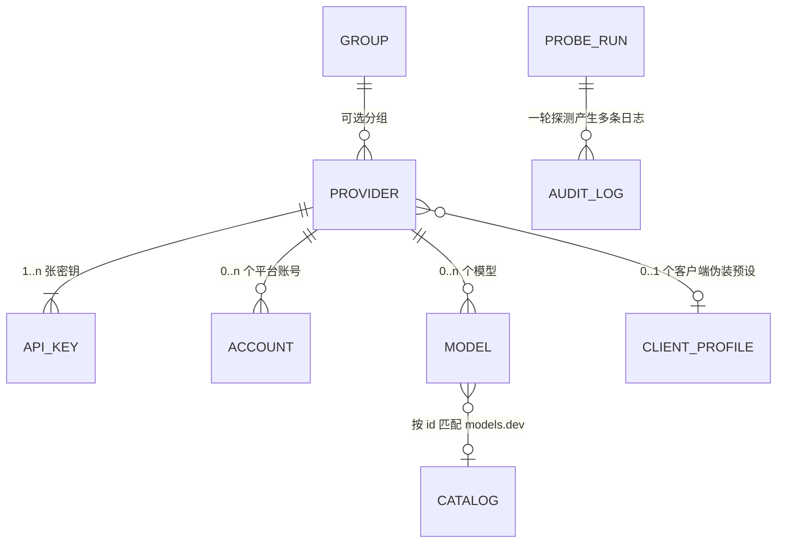

# 元记 · AI Token Vault — 开发计划

Android 原生应用。集中管理 AI API Key、端点、模型与余额，纯本地加密存储，密钥不离开设备。

技术栈：**Kotlin + Jetpack Compose + MIUIX**。全新项目，无历史包袱。

---

## 0. 文档状态与既定事实

| 项 | 值 |
| --- | --- |
| 版本 | v3.2（Android 原生重写版；v3 评审后修正，M0.5 协议踩点后按实测改写） |
| 日期 | 2026-09-04 |
| 输入 | `示例数据.md`、三个参考项目、models.dev / DeepSeek / new-api / MIUIX 官方文档、**M0.5 对三家真实中转站的实测响应**（`app/src/test/resources/fixtures/`） |
| 状态 | 除第 18 节的 2 项决策 + 1 项未实测（额度耗尽的真实响应）外，其余已定 |

v3.2 相对 v3.1 的改动都来自 M0.5 实测，集中在：新增红线 33–35；§5.2（`max_tokens=16` 不保证有内容、`supported_endpoint_types`、鉴权风格兜底要双向）；§8.1（host 级最小间隔）；§8.2（客户端闸用 401、只看 UA、「适用协议」不是硬过滤）；§8.3（成本文案、基线检测的 401 例外）；§8.4（矩阵新增第 5 行、SUCCESS 判据放宽、body 是可选输入）；§9.2（`quota_per_unit` 实测 500000、不许先截断响应体）；§7.5（脱敏要替换后缀）。逐条对照见 §16「M0.5 实测结论」。

以下事实已实测或经官方文档确认，本计划的接口规格基于它们：

- `https://models.dev/api.json` = 4.46 MB，按厂商嵌套，模型条目**含 `cost`**（`input` / `output` / `cache_read` / `cache_write`）与 `limit`（`context` / `output`）、`modalities`、`reasoning`、`tool_call`。
- `https://models.dev/models.json` = 296 KB，扁平 map（key 形如 `vendor/model`），**不含价格**。
- DeepSeek 官方余额：`GET /user/balance` → `{"is_available":bool,"balance_infos":[{"currency":"CNY|USD","total_balance":"110.00","granted_balance":"10.00","topped_up_balance":"100.00"}]}`。注意金额是**字符串**。
- new-api：管理接口用 `Authorization: Bearer <访问令牌>`，部分接口要求附加 `New-Api-User: {user_id}` 头；**1 USD = 500,000 quota**。
- MIUIX 最新稳定版 **0.9.3**（0.9.4 还是 rc01），坐标 `top.yukonga.miuix.kmp:miuix-ui`。KMP 根坐标在 Android 上靠 Gradle 元数据选变体，直接用即可；只有 `miuix-blur` / `miuix-shader` 必须写 `-android` 后缀。模块有 `miuix-ui` / `miuix-preference` / `miuix-icons` / `miuix-squircle` / `miuix-blur`（要求 minSdk 33）/ `miuix-shader`；官网文档里的 `miuix-nav` **只发到 0.9.4-rc01**，本项目用 `androidx.navigation`，不需要它。官方标注**实验阶段，API 可能无预告变更**。
- MIUIX 的 `Overlay*` 组件（`OverlayDialog` / `OverlayBottomSheet` / `OverlayDropdownPreference` / `OverlayListPopup` …）必须被 MIUIX 的 `Scaffold` 包裹，但**不要求全局只有一个 Scaffold**：`Scaffold` 有 `popupHost` 参数且默认值就是 `{ MiuixPopupHost() }`，官方文档明确写「每个 `Scaffold` 会自动管理独立的弹出层状态，多个嵌套或并列的 `Scaffold` 无需额外配置即可正常工作」。所以 13.1 的 Shell 采用**分层 Scaffold**（外层只管底栏与 Snackbar，页面各自持有自己的 topBar），而不是单个全局 Scaffold。
- MIUIX 另有一套 `Window*` 组件（`WindowDialog` / `WindowBottomSheet` / `WindowListPopup` / `Window*Menu` / `Window*Preference`），它们是**独立系统窗口**，`FLAG_SECURE` 不会继承。本项目**只允许 `Overlay*`**，`Window*` 由 CI 检查禁掉（见 7.5、13.2）。
- MIUIX 0.9.3 自带 `Snackbar` / `SnackbarHost` / `SnackbarHostState` / `SnackbarDuration` / `SnackbarResult`（`top.yukonga.miuix.kmp.basic`），挂在 `Scaffold(snackbarHost = …)` 上。因此**不需要为了 Snackbar 引入 `material3`**（Scaffold 那一页文档里"Miuix 不提供此组件"的说法已过时，以 Snackbar 组件页为准）。
- 客户端指纹（Claude Code / Codex CLI 等的 `User-Agent` 与特征头）**没有官方文档**，随客户端版本漂移。本计划给出的内置预设是最佳已知值，必须以真实抓包校准，并且必须提供 cURL 导入让用户自己补（见 8.2）。
- `示例数据.md` 里是**真实可用的密钥、访问令牌与账号**，仓库**永不提交**（`.gitignore` 写死）。它的用途是本地模拟器 / 真机通过 ADB 做端到端验收（真实导入、真实探测、真实余额）。CI 里的 JVM 单测改用一份提交进仓库的**脱敏 fixture**，结构与真实文件逐字节等价（见 14.3）。

---

## 1. 参考项目

| 项目 | 借鉴什么 |
| --- | --- |
| [lswlc33/photo](https://github.com/lswlc33/photo) | 工程规范全套：单模块 `:app` + 纯 Kotlin 领域层（Android 部分以 lambda 注入，核心逻辑在 JVM 上可测）、Compose + MIUIX、JDK 17 / minSdk 33 / compileSdk 37、`.githooks`（pre-commit 编译+单测，commit-msg 中文）、nightly 预发布 + tag 正式发布双 workflow、`AGENTS.md`（风格与组件规范）与 `CLAUDE.md`（架构与不变量）分工、中文文案优先且 `values/` 与 `values-zh-rCN/` 双份 strings.xml |
| [farion1231/cc-switch](https://github.com/farion1231/cc-switch) | 供应商预设库（选中即填）、写库前自动轮转备份（保留 10 份）、导入前自动快照、Deep Link 导入、用量看板的信息组织方式 |
| [MIUIX](https://compose-miuix-ui.github.io/miuix/zh_CN/components/) | UI 组件库本体 |

---

## 2. 产品定义

### 2.1 一句话

一个离线优先的 Android 应用，把散落在各个中转站和官方平台的 API Key、端点、可用模型、余额收进一个加密本地库，并能一键验证它们**现在**是否真的可用。

### 2.2 核心场景

1. **录入** — 拿到一个新中转站，粘贴一段像 `示例数据.md` 那样的文本，直接生成供应商 + Key + 模型列表 + 余额配置。
2. **验证** — 点一次"全部探测"，十几秒内知道哪张 Key 死了、哪个模型 404、哪个号欠费、哪家站只放行特定客户端。
3. **取用** — 临时要用某个模型，两秒内找到供应商，复制 Key 与 Base URL，或直接复制成 CLI 环境变量。
4. **盘点** — 首页按币种看总余额，知道该给哪个号充钱。
5. **登录** — 要去中转站后台充值或看用量时，顺手拿到该平台的登录账号与密码（纯记录，见 2.3）。

### 2.3 平台账号记录（顺带做的事）

中转站的 API Key 和它的**登录账号**天然是一对：查用量、充值、拿访问令牌都要登录后台。所以每个供应商下允许记若干条「平台账号」——账号（邮箱 / 手机号 / 用户名）、密码、备注、登录地址。

它与 API 密钥**共享同一套安全策略**：字段级加密、遮蔽显示、30 秒回遮、剪贴板自动清除、日志脱敏、`FLAG_SECURE`、随加密备份包一起走。

它**不是密码管理器**，边界写死在这里，不做也不许后续悄悄加：

- 不做 Autofill 服务、不做浏览器 / 应用内自动填充
- 不做 TOTP / 二次验证码
- 不做密码生成器、不做强度评分
- 不做泄露检测、不做换密提醒
- 不做除本供应商之外的任意站点条目（它挂在供应商下，不是独立的密码库）

理由：做一半的密码管理器比不做更危险，用户会误以为它能替代专业工具。UI 上「平台账号」区块常驻一行小字说明"仅本地记录，不填充、不校验"。

### 2.4 非目标

- 不做 API 代理、请求转发、故障转移。
- 不做通用密码管理器（边界见 2.3）。
- 不做云端账号。同步只有用户自己的 WebDAV。
- 不做逐请求用量与成本统计（上游不给数据，做不准），只做余额快照。
- 不支持 iOS / 桌面 / Web。

---

## 3. 设计红线

这些是架构层面的硬约束，写进 `CLAUDE.md`。它们的共同点是：违反了不会立刻崩，但会在某个时刻造成不可挽回的后果。

编号 1–23 来自 v3，24–32 是 v3 评审后补的，**33–35 是 M0.5 协议踩点实测出来的**（见 §16「M0.5 实测结论」），**36 来自 M0.8 之后的一次结构修正**（探测开关下放到每个供应商）。**编号只作稳定标识，不代表优先级或顺序**，所以后补的条目直接挂在各组末尾而不重排。

**密钥与加密**

- **1.** 明文密钥只允许存在于两处：内存中的 `ByteArray` / `CharArray`，和 HTTP 请求头。任何落盘、任何日志、任何异常消息里都不能出现。
- **2.** 数据密钥（DEK）是随机生成的，PIN 只用来包裹它。**改 PIN 必须是 O(1) 操作**（重新包裹 DEK，一次写入），不允许出现"改 PIN 要全库重加密"的设计。
- **3.** KDF 参数与盐**随密文一起存储**，代码里的常量只是"新建时用什么"。任何"发现存储的参数与编译期常量不一致就改写存储值"的逻辑都是永久锁库的定时炸弹。
- **4.** 生物识别解锁必须由 Android Keystore 硬件密钥保护，且 `setUserAuthenticationRequired(true)`。不允许出现"用可猜测的值派生密钥、把 DEK 加密后落盘"这类等价于后门的实现。
- **5.** 生物识别开关的状态由独立的持久化偏好决定，不由"设备是否有指纹传感器"决定；关闭后任何解锁路径都不得把它悄悄打开。
- **6.** 锁定时 DEK 与所有派生子密钥置零，并且 DEK 只由唯一的会话对象持有，其他服务通过短暂借用获取，不允许长期持有同一个数组实例。
- **24.** 每条字段级密文的 AAD **必须绑定它所在的行身份**（`"表名:主键"`）。没有 AAD 绑定时，有文件写权限的攻击者可以把 A 供应商的 `secretEnc` 覆盖到 B 供应商的行上，解密照样成功，应用就会把 A 的密钥发到 B 的 host。
- **25.** DEK 的包裹方式可以有多个（PIN / 生物识别 / **恢复密钥**），但**明文 DEK 只有一份**，新增包裹方式不得改变 DEK 本身。因此"忘记 PIN"必须有恢复密钥这条出路，且加它的代价只是多一次 wrap。

**数据完整性**

- **7.** 备份包必须是**自包含的**：内含 KDF 参数、盐、以及**明文密钥**（整包已加密）。绝不搬运用旧设备密钥加密的密文，否则换设备即永久丢失。
- **8.** 解密失败必须报错并中断，不允许静默降级成 `null`。
- **9.** 任何跨版本恢复都要走显式迁移函数，不允许把旧结构的行直接插入新表。
- **10.** 数据库是唯一数据源，UI 通过 Flow 观察，不允许"写完手动通知各处刷新"。
- **26.** **boot 存储的每次写入必须是原子的**（写临时文件 → fsync → rename）。改 PIN、开关生物识别、累加失败计数都会写 boot，一次撕裂写入等于永久锁库。同时必须存在 `BootCorrupt` 这个显式状态，引导用户去恢复备份，而不是白屏或崩溃。
- **27.** **备份包里的跨表引用一律用自然键**（分组名、`builtinKey`、指纹重算），绝不搬运自增主键。新设备上内置预设与分组是重新生成的，ID 必然不同。同理，任何用 DEK 派生密钥算出来的指纹跨设备不可比，导入时必须用包内明文在本机重算。
- **28.** 备份包**不搬运探测结果**。`health` / `lastOutcome` / `checkedAt` / `okAt` / `latencyMs` / `probeState` 恢复后一律重置为未探测，否则"上次成功于"显示的是另一台设备的时间。

**探测正确性**

- **11.** **瞬时失败绝不修改健康结论**。网络类失败（超时 / DNS / TLS / 连接失败）、429、5xx 都属于瞬时失败：它们只写"最近一次探测结果类型"（`lastOutcome`）、最后探测时间与错误详情，`health` 保留上一次的持久结论，UI 显示"上次成功于 …"。一次限流不能把昨天验证过的密钥标成坏的。
- **12.** `GET /v1/models` 返回 200 **不等于** Key 有效——很多中转站的该路由不鉴权。有效性结论必须能升级为真实的极简推理调用。反过来也成立：**除 401 / 403 之外的任何结构化上游响应都证明鉴权已经通过**，400 只说明请求参数不被接受，不能因此把一张好密钥判成坏的。
- **13.** 自动同步模型列表时，手动录入的条目永不被自动修改；上游消失的条目标记停用而不是删除。
- **14.** 余额是"可用额度"，不是通用的"总额减已用"。减法只写在明确提供两个量的那个适配器内部，不做成通用配置项。
- **15.** 余额必须带币种。展示不硬编码货币符号，阈值不硬编码数值。
- **29.** **探测不允许把自己探成失败**。单个供应商单轮的请求次数必须有上限（基线 + 鉴权风格重试 + L2 + 预设嗅探叠起来很容易撞上中转站的限流），一旦本轮出现 429 就停止该 host 的后续可选请求（尤其是预设嗅探），而不是继续试下一个。**并发上限之外还必须有 host 级最小间隔**：M0.5 实测挂 Cloudflare 的站在约 2.4 秒内的第 3 个请求就返回 `error code: 1015`，而 `maxRequestsPerHost = 3` 恰好会让三个请求同时出去。
- **30.** **发现来的模型必须记住它是从哪个协议的列表里来的**。`GET /v1/models` 不返回协议，所以"上游消失即停用"的作用域只能限定在**本轮实际查询过的那个协议**，否则只拉了一个协议的列表就会把别的协议下的发现项全部停用。（new-api 系会给 `supported_endpoint_types`，有这个字段时按它写协议，作用域问题自然消失；没有才退回按路由限定。）
- **33.** **客户端校验可能返回 401，而且拦在鉴权之前**。M0.5 实测：Agent Router 对带 `Authorization: Bearer` 的请求一律回 `401` + `unauthorized client detected`，密钥有效与否都一样。所以客户端关键词判定必须排在 **401** 分支之前（不只是 403 之前），否则"换个 UA 就能用"会被判成"密钥无效"，而这正是客户端伪装功能存在的理由。
- **34.** **200 不代表拿到了内容**。`max_tokens=16` 在推理模型上会得到 200 + `content: ""` + `finish_reason: "length"`，或 200 + `status: "incomplete"` 且 `output` 里只有 reasoning。判 `SUCCESS` 的条件只能是"2xx + 能解析成 JSON + 没有 `error` 字段"，**不许要求文本非空**，否则整类推理模型会被判成失败。
- **35.** **非 2xx 的响应体经常不是 JSON，甚至完全是空的**。实测形态：`error code: 1015`（纯文本）、`Authentication Fails (governor)`（纯文本）、`403` + 空 body、`404` + 空 body。`classify` 必须把 body 当**可选**输入：JSON 解析失败不是异常、不许升级成 `CONFIG_ERROR`；没有 body 时按状态码分流，detail 写"上游未提供原因"而不是编一个理由。
- **36.** **要花钱的探测只能由用户手动点，而且开关按供应商单独存。** 任何会产生真实推理调用的动作（L3 逐模型、models 路由不鉴权时的升级版 L2）都不允许出现在自动路径上——自动探测、定时任务、解锁后探测、"重试失败项"一概不许触发它们，碰到就标 `SKIPPED` 并说明原因，等用户自己点。理由有两层：一是成本不可预估（M0.5 实测：只发一个 `ping`，中转站回的 `input_tokens` 是 7021，输入量由对方决定），二是**每家站的规则不一样**——有的按 ToS 不允许自动化探测，有的三个请求就限流。所以四个级别的开关连同一个总闸都存在 `providers` 行上，设置里的同名项只是"新建时的默认值"（见 8.3）。这条错了不会报错，后果是替用户无声花钱、或者去碰一个明确说了别碰的站。

**产品完整性**

- **16.** 每个持久化字段都必须有 UI 入口或明确的产生路径。没有入口的字段不要建。
- **17.** 同一状态在全应用只有一套中文文案和一套颜色，来源唯一。状态必须同时用颜色和文字表达，不允许只靠色点。
- **18.** 协议（Chat / Responses / Anthropic）属于**模型**，能力集合属于**供应商**，二者不能互相推导。
- **19.** 用户可见文本一律进 `values/strings.xml` 与 `values-zh-rCN/strings.xml`，Compose 代码里不留中文字面量。
- **20.** 领域逻辑写成不依赖 Android 的纯 Kotlin，平台能力以接口/lambda 注入，使其可在 JVM 单测中覆盖。**当前时间也算平台能力**：纯 Kotlin 层不允许直接调 `Clock.System`，必须注入 `Clock`，否则一切与 `checkedAt` / `okAt` / TTL 有关的测试都会变成时间敏感的。
- **31.** **同一个配置项只能有一个权威存储**。`boot` 只存解锁前必须可读的那几项（KDF 参数、包裹后的 DEK、退避计数、`themeMode` / `localeTag` / `onboarded`），`app_settings` **不得重复这些键**；其余设置只在 `app_settings`。两处都存就是红线 10 换了个马甲。

**凭据边界与可解释性**

- **21.** 平台账号的用户名与密码与 API 密钥**同等对待**：同一套字段级加密、遮蔽、回遮、脱敏、剪贴板策略。账号功能不得越界成密码管理器（2.3 的六条禁止项）。
- **22.** 客户端伪装预设是**数据不是代码**：请求头集合存库、可编辑、可从 cURL 导入。探测代码里不允许硬编码任何客户端的 `User-Agent` 或特征头。
- **23.** 明确记录**哪些列加密、哪些明文**，并在"关于"页对用户说明。不允许存在"看起来像加密了其实没有"的列。
- **32.** **落库前的脱敏以"已知明文值替换"为主，正则只作兜底**。正则挡不住任意形态的凭据——`EXAMPLEtoken0000/EXAMPLE0000000=` 这种 base64 访问令牌不匹配任何一条 `sk-` / `Bearer` 规则。任何要落库或落日志的字符串，先把当前会话已知的密钥 / 令牌 / 密码明文（**及其 ≥8 字符前缀与 ≥4 字符后缀**）替换成 `<已省略>`，再过正则。后缀那一半是 M0.5 实测补的：DeepSeek 的 401 回 `Your api key: ****alid is invalid`，掩掉了前面、**回显的是后 4 位**。

---

## 4. 技术栈

### 4.1 选型

| 层 | 选择 | 理由 |
| --- | --- | --- |
| 语言 / 工具链 | Kotlin **2.3.21**，JDK 17，Gradle **9.5.0**，AGP **9.3.2**，KSP **2.3.11** | 与 `photo` 同一套（AGP 9.3.2 + compileSdk 37 已在本机验证）。AGP 9 **自带 Kotlin 支持**，所以插件块里不写 `org.jetbrains.kotlin.android`。Kotlin 停在 2.3 线是因为 KSP 最新版 2.3.11 依赖 `kotlin-stdlib 2.3.20`——2.4.x 目前没有对应的 KSP |
| SDK | minSdk 33 / compileSdk 37 / targetSdk 37 | `miuix-blur-android` 要求 33；与 `photo` 一致 |
| UI | Jetpack Compose + **MIUIX 0.9.3** | 不引入 `material3`，避免两套主题打架 |
| 导航 | `androidx.navigation:navigation-compose` 类型安全路由（`@Serializable` 路由对象） | 二级页多、需要深链，手写状态机会失控 |
| 状态 | ViewModel + `StateFlow` + `collectAsStateWithLifecycle` | |
| 数据库 | **Room** + KSP，跑在**系统自带 SQLite** 上 | 见 4.4 的取舍说明。Room 不是另一个数据库，它就是"直接用 SQLite"外加编译期 SQL 校验、`Flow` 查询和可测迁移 |
| 启动期存储 | 一个未加密的 boot 存储（Keystore 包裹材料 + 主题等启动必需项） | KDF 盐与包裹后的 DEK 必须在解锁前可读 |
| HTTP | **OkHttp**（不用 Retrofit） | 要构造动态 URL、动态头、原始 JSON body；OkHttp 的 `Dispatcher.maxRequestsPerHost` 正好满足同 host 限并发；`MockWebServer` 让协议适配器能在 JVM 上做真实测试 |
| 序列化 | `kotlinx.serialization`（含 `decodeFromStream`） | models.dev 4.46 MB 要按厂商分块解析，见 10 节 |
| 并发 | Coroutines + Flow | |
| DI | **Hilt** | ViewModel 注入 + `HiltWorker`（自动备份要用 WorkManager） |
| 后台任务 | WorkManager | 周期备份、定时探测 |
| 加密 | Android Keystore + `androidx.biometric` + BouncyCastle（Argon2id） | |
| 时间 | `kotlinx-datetime`，纯 Kotlin 层**注入 `Clock`** | 直接调 `Clock.System` 会让 `checkedAt` / TTL 相关的单测变成时间敏感（红线 20） |
| 偏好 | 解锁后的设置存 Room 的 `app_settings` 表，**不用 DataStore**；解锁前必需的几项存 `boot` | 单一数据源，且设置项要随备份一起走事务；两处不得重复同一个键（红线 31） |
| 测试 | JUnit4 + `kotlinx-coroutines-test` + Turbine + MockWebServer + `room-testing` + `hilt-android-testing` + `work-testing` + Compose UI Test；Robolectric 仅在必要处 | |

### 4.2 项目结构

单模块 `:app`，包名 `com.lc33.tokenvault`。按 `photo` 的做法用包划分而不是 Gradle 模块划分，但**纯 Kotlin 层与 Android 层在包级别严格分开**。

```
app/src/main/java/com/lc33/tokenvault/
  domain/                纯 Kotlin。不可变数据类 + 枚举，零 Android import、零 Room import
    Provider.kt  ApiKey.kt  ProviderAccount.kt  ModelEntry.kt  Protocol.kt  ClientProfile.kt  KeyHealth.kt  BalanceSnapshot.kt …
  endpoint/              纯 Kotlin。URL 规范化、三协议请求构造与响应解析、客户端伪装预设的头部组装（全是纯函数）
  probe/                 纯 Kotlin。探测编排、错误分类、结果合并
  balance/               纯 Kotlin。BalanceAdapter 接口 + 6 个内置实现
  catalog/               纯 Kotlin。models.dev 流式解析、归一化与匹配
  importer/              纯 Kotlin。示例数据格式的解析与反向导出、cURL 命令解析（用于客户端预设导入）
  backup/                纯 Kotlin。备份包编解码、合并策略
  crypto/                纯 Kotlin。Argon2id、AES-GCM 封套、HKDF、脱敏
  net/                   OkHttp 实现层。HttpEngine 接口的实现 + 脱敏拦截器
  data/                  Android。Room 实体 / DAO / 迁移 / 映射器 / 仓库实现
  platform/              Android。Keystore、BiometricPrompt、剪贴板、文件选择、WorkManager、窗口安全
  di/                    Hilt Module
  ui/
    theme/               AppTokens、StatusPalette、AppColorSchemeMode（无 MIUIX 依赖）
    miuix/               MIUIX 包装层，**含 AppTheme**（AppScaffold / AppCard / AppRow / AppDialog / AppIcon …）
    common/              StatusDot、SecretText、RelativeTime、空态/错误态
    shell/               AppRoot、LockGate、VaultShell、NavGraph、Routes
  screens/
    vault/  detail/  editor/  importer/  probe/  settings/  lock/  log/
  TokenVaultApp.kt       Application（Hilt 入口）
  MainActivity.kt        FragmentActivity（BiometricPrompt 要求）
```

### 4.3 分层规则

- `domain/` `endpoint/` `probe/` `balance/` `catalog/` `importer/` `backup/` `crypto/` 这八个包**不允许出现 `android.*` / `androidx.*` / `androidx.room.*` / `okhttp3.*` 的 import**，也**不允许出现 `Clock.System`**。用一条自定义 lint 规则或 CI 里的 `grep` 检查守住。
- `screens/` 不允许出现 SQL、不允许构造 HTTP 请求、不允许直接接触 `crypto/`。
- `ui/miuix/` 是唯一允许 `import top.yukonga.miuix.*` 的包，且其中**只允许 `Overlay*` 系列弹层**；`WindowDialog` / `WindowBottomSheet` / `Window*Popup` / `Window*Menu` / `Window*Preference` 一律禁用（它们是独立系统窗口，`FLAG_SECURE` 不继承），同样由 CI `grep` 守住。
- Room 实体只存在于 `data/`，与 `domain/` 的模型是两套类，中间有显式映射器。理由：实体要迁就 Room 的可变性与列类型，领域模型要保持不可变且带业务方法，混用会让两边都变形。
- 仓库接口定义在 `domain/repo/`，实现在 `data/`。ViewModel 只依赖接口，因此可以用假实现做 UI 测试。

### 4.4 数据库取舍：为什么是 Room 跑在系统 SQLite 上

"直接用 SQLite"其实是两个独立问题，分开回答。

**问题一：要不要 SQLCipher 整库加密？→ 不要。**

密钥、访问令牌、账号密码这些真正的秘密已经是字段级 AES-256-GCM 加密，SQLCipher 额外保护的只是**元数据**（供应商名称、备注、端点、模型列表、余额数字、时间戳）。为这点收益付的代价是：每 ABI 多 1–2 MB 原生库、多一个必须持续跟版的第三方依赖、Room 迁移测试要配自定义 `SupportOpenHelperFactory` 才能跑、数据库只能在解锁后打开（连主题设置和元数据同步都要等解锁）。

不划算。改用系统自带 SQLite 后还额外拿到三个好处：

- Room 实例是**应用级单例**，启动即建，锁定时只清 DEK 不关库。省掉一整类"关库后 `Flow` 仍在收集"导致的崩溃。
- models.dev 元数据同步、`dataRevision` 检查这类只碰公开数据的后台任务，**锁定状态下也能跑**。
- APK 更小，依赖更少。

代价必须诚实写出来（红线 23）：**元数据在应用私有目录里是明文的**。宣传语因此要精确成"密钥与账号密码经 AES-256-GCM 加密存储"，而不是含糊的"整库加密"。这个区别写进"关于"页。真要整库加密时，SQLCipher 可以在 M11 一次性接入（用 `sqlcipher_export()` 迁移已有库），不做运行时开关。

**问题二：要不要 Room，还是裸写 `SQLiteOpenHelper`？→ 要 Room。**

| 需求 | Room | 裸 SQLite |
| --- | --- | --- |
| 列表页数据变化后自动刷新（红线 10） | `Flow<List<T>>` 查询自带失效通知 | 要自己造一套变更通知与订阅，而这正是红线 10 禁止的"手动通知刷新" |
| SQL 写错 | 编译期报错 | 运行时崩 |
| Cursor → 对象映射 | 生成 | 手写，每加一列改三处 |
| 迁移可测 | `MigrationTestHelper` + 提交的 schema JSON | 自己搭测试脚手架 |
| 多表事务 | `@Transaction` | 手写 begin/commit，异常路径容易漏 |

Room 编译产物就是普通的 `SQLiteOpenHelper` + `Cursor` 代码，运行时开销可忽略，唯一成本是 KSP 增量编译时间。它换来的是上表五行——尤其第一行是架构级依赖，不用 Room 就得自己实现一遍且大概率更差。

**加密边界（写进 `CLAUDE.md` 与"关于"页）**

| 加密（字段级 AES-256-GCM） | 明文 |
| --- | --- |
| `api_keys.secretEnc` | 供应商名称、备注、官网、端点、协议、路径覆盖 |
| `provider_accounts.usernameEnc` / `passwordEnc` | 模型 id、显示名、探测状态、延迟 |
| `providers.balanceTokenEnc`（NewAPI 访问令牌） | 余额金额、币种、原始文本 |
| `app_settings.valueBlob` 里的 WebDAV 用户名 / 密码 | 分组、颜色、排序、时间戳、日志、客户端预设 |

---

## 5. 领域模型

### 5.1 概念



`示例数据.md` 里 Agent Router 支持三种协议，但 `claude-opus-5` 只能走 Anthropic、`gpt-5.6-sol` 只能走 Responses。这就是红线 18 的来源：`provider.supportedProtocols` 用于决定"能拉哪些模型列表、界面上给哪些选项"，`model.protocol` 用于决定"这个模型该发到哪个路径、用哪种 body"。

### 5.2 协议与 URL 规范化

**协议表**（`domain/Protocol.kt`，同时是 `endpoint/` 的请求构造依据）：

| 值 | 展示名 | 默认路径 | 鉴权头 | 极简探测 body |
| --- | --- | --- | --- | --- |
| `CHAT` | Chat Completions | `/{ver}/chat/completions` | `Authorization: Bearer <key>` | `{"model":M,"messages":[{"role":"user","content":"ping"}],"max_tokens":16,"stream":false}` |
| `RESPONSES` | Responses（原生） | `/{ver}/responses` | `Authorization: Bearer <key>` | `{"model":M,"input":"ping","max_output_tokens":16,"store":false}` |
| `ANTHROPIC` | Anthropic Messages | `/{ver}/messages` | `x-api-key: <key>` + `anthropic-version: 2023-06-01` | `{"model":M,"max_tokens":16,"messages":[{"role":"user","content":"ping"}]}` |

`max_tokens` 取 **16 而不是 1**：思考类模型（示例数据里的 `claude-opus-5-thinking` 就是）要求 `max_tokens` 大于思考预算，给 1 会稳定拿到 400，把好密钥判成配置错误。16 个 token 的成本可以忽略。

**但 16 只保证请求被接受，不保证拿到内容**（M0.5 实测）：DeepSeek 的推理模型在 `max_tokens=16` 下返回 200 + `content: ""` + `finish_reason: "length"`，内容全在 `reasoning_content` 里；`/v1/responses` 则是 200 + `status: "incomplete"` + `output` 里只有 reasoning 没有 message。所以**判 SUCCESS 的代码不许要求文本非空**，否则整类推理模型会被判成失败。见 `fixtures/probe-matrix.json` 的 `deepseek-chat-empty-content-200` 与 `deepseek-responses-incomplete-200`。

模型列表：OpenAI 系 `GET /{ver}/models` → `{"data":[{"id":…}]}`；Anthropic 系同路径但换鉴权头 → `{"data":[{"type":"model","id":…,"display_name":…}]}`。**两条路由是两份列表**，发现来的模型要记住自己来自哪一条（红线 30）。

new-api 系还会在每个模型上附 **`supported_endpoint_types`**（实测值 `["anthropic","openai"]` / `["openai"]`）。这是「协议属于模型」（红线 18）的现成数据源：**有这个字段就直接用，不要靠模型名猜协议**；没有就退回「本次是从哪条路由拉到的」。DeepSeek 官方的列表没有这个字段。

公共头：`Accept: application/json`、`Content-Type: application/json; charset=utf-8`、固定 `User-Agent: YuanJi/<版本> (Android)`（部分中转站会拒绝空 UA）。任何探测请求都不带 `stream`。

**规范化算法** `normalizeBaseUrl(input): ApiEndpointSet`：

1. `trim()`，去掉末尾所有 `/`；空则报错。
2. 无 scheme 补 `https://`；只接受 `http` / `https`。
3. **带 query 或 fragment 的输入直接报错**（`https://host/v1?key=abc` 这种粘贴很常见，静默丢掉参数会得到一个看起来对、其实永远 401 的端点）。报错文案指向"请只填到路径部分"。Azure OpenAI 那种必须带 `?api-version=` 的形态**不在支持范围内**，在错误提示里直接说明。
4. 若路径最后一段匹配 `^v\d+(beta|alpha)?$`（`v1` / `v4` / `v1beta`），**剥离该段**得到 `apiRoot`，该段记为 `ver`；否则 `apiRoot = 输入`，`ver = "v1"`。
5. 协议完整 URL = `apiRoot + (pathOverrides[protocol] ?: 默认路径.replace("{ver}", ver))`。
6. `origin = scheme://host[:port]`，作为余额查询地址的默认值。

用 `示例数据.md` 的三条数据验证（这三行是单测的固定用例）：

| 输入 | `apiRoot` | ver | CHAT | RESPONSES | ANTHROPIC | models | 余额默认地址 |
| --- | --- | --- | --- | --- | --- | --- | --- |
| `https://ps.air-outer.com/v1` | `https://ps.air-outer.com` | v1 | `…/v1/chat/completions` | `…/v1/responses` | `…/v1/messages` | `…/v1/models` | `https://ps.air-outer.com` |
| `https://api.justwoker.icu/v1` | `https://api.justwoker.icu` | v1 | 未启用 | 未启用 | `…/v1/messages` | `…/v1/models` | `https://api.justwoker.icu` |
| `https://api.deepseek.com/v1` | `https://api.deepseek.com` | v1 | `…/v1/chat/completions` | `…/v1/responses` | 需覆盖为 `/anthropic/v1/messages` | `…/v1/models` | `https://api.deepseek.com` |

`https://openrouter.ai/api/v1` 这类带子路径的也正确：剥掉尾部 `v1` 得 `https://openrouter.ai/api`，拼回去还是对的。DeepSeek 的 Anthropic 兼容端点在 `/anthropic` 下——**不要用启发式猜，让用户覆盖**，这就是 `pathOverrides` 存在的理由。**M0.5 实测确认**：`POST /v1/messages` → **404 且响应体完全为空**，`POST /anthropic/v1/messages` → 200。猜错路径时上游一个字都不给，所以「猜」这条路本来就走不通。

**鉴权风格兜底**：部分中转站的 Anthropic 端点只认 `Authorization: Bearer`。`provider.authStyle = auto` 时，Anthropic 协议先发 `x-api-key`，收到 401/403 再用 `Authorization: Bearer` 重试一次；成功则把 `authStyle` 固化为 `bearer` 并记一条日志。另有 `bearer` / `xApiKey` 两个强制值。

**M0.5 把这条的意义修正了一半**：三家里没有一家「只认 Bearer」——JustDoWork 的 `/v1/messages` 两种头都返回 200，DeepSeek 的 `/v1/models` 两种头也都返回 200。真正遇到的是**反方向**的问题：Agent Router 的**客户端校验只挂在 `Authorization: Bearer` 那条路径上**，同一个 UA 用 `x-api-key` 就直接 200，用 Bearer 就 401 `unauthorized client detected`。所以兜底重试要**双向**：`x-api-key` 失败换 Bearer，Bearer 撞客户端闸也要试 `x-api-key`——后者比换客户端预设更便宜，应当排在嗅探之前。


### 5.3 状态枚举与文案

状态分成**两个正交的东西**，这是红线 11 在类型层面的表达：

- `KeyHealth` —— **持久结论**，落 `api_keys.health`。只有能真正判定密钥好坏的响应才允许改写它。
- `ProbeOutcome` —— **最近一次探测发生了什么**，落 `api_keys.lastOutcome`。每次探测都写，包括瞬时失败。

只有一个 `health` 列时，UI 无法既显示"上次成功于 …"又说明这次为什么没验证成功，只能去解析 `healthDetail` 字符串——所以必须是两列。

`KeyHealth` — 全应用唯一的一套文案与颜色（红线 17）：

| 值 | 文案 | 触发 | 颜色 |
| --- | --- | --- | --- |
| `UNKNOWN` | 未探测 | 初始 | neutral |
| `OK` | 可用 | 探测成功 | ok |
| `UNAUTHORIZED` | 密钥无效 | 401 | error |
| `FORBIDDEN` | 无权限 | 403 且未命中额度 / 客户端关键词 | error |
| `INSUFFICIENT` | 余额不足 | 402，或任意 4xx/5xx 且上游消息命中额度关键词 | warn |
| `CONFIG_ERROR` | 配置错误 | 400 参数不被接受、404 路径错、返回非预期内容 | warn |
| `CLIENT_BLOCKED` | 需客户端伪装 | 上游按客户端指纹拦截（4xx 且消息命中客户端校验关键词，见 8.2） | warn |

**注意 `KeyHealth` 里没有 `NETWORK_ERROR` / `RATE_LIMITED` / `UPSTREAM_ERROR`**。它们是瞬时状况，属于 `ProbeOutcome`，永远不写进 `health`；留在 `KeyHealth` 里迟早会有人写进去。

`ProbeOutcome` — 每次探测都写，同时决定"是否允许改写 health"：

| 值 | 文案 | 触发 | 改写 health |
| --- | --- | --- | --- |
| `SUCCESS` | 成功 | 2xx 且结构符合预期 | 是 → `OK` |
| `CONCLUSIVE_FAIL` | 已判定失败 | 401 / 403 / 402 / 400 / 404 / 额度或客户端关键词命中 | 是 → 对应 `KeyHealth` |
| `NETWORK_ERROR` | 网络不可达 | 超时 / DNS / TLS / 连接失败 | **否** |
| `RATE_LIMITED` | 被限流 | 429 且重试后仍然 | **否** |
| `UPSTREAM_ERROR` | 上游故障 | 5xx 且重试后仍然 | **否** |
| `SKIPPED` | 本轮未探测 | 超总预算 / 撞 host 预算 / 锁定 | **否**（连 `checkedAt` 都不写） |
| `CANCELLED` | 已取消 | 用户取消 | **否**（什么都不写） |

UI 规则：`lastOutcome` 是瞬时类时，主状态显示 `health` 的文案 + 一行副文案"本轮网络不可达 · 上次成功于 3 小时前"；`okAt` 为空时副文案退化成"尚未验证成功过"。

`ModelProbeState`：`UNKNOWN` 未探测 / `OK` 可用 / `NOT_FOUND` 模型不存在 / `NO_ACCESS` 无权访问 / `ERROR` 探测失败。模型行同样有独立的 `lastOutcome`，规则与上表一致。

`BalanceState`（派生，不入库）：`UNKNOWN` 未查询 / `OK` 正常 / `LOW` 偏低 / `NEGATIVE` 欠费 / `ERROR` 查询失败。阈值按币种配置，默认 USD 5 / CNY 30。

**供应商聚合状态**：用户在首页问的是"这家现在还能不能用"，所以规则是——启用的 Key 里**只要有一张 `OK` 就是 `OK`**；一张都没有时取最坏的那个。卡片上的"可用数 / 总数"负责表达细节（1 张好 + 1 张废的供应商不该显示成红色）。瞬时失败不参与比较，只在角标上体现"本轮未能验证"。

---

## 6. 数据层（Room + 系统 SQLite）

### 6.1 两个存储

| 存储 | 内容 | 加密 | 何时可读 |
| --- | --- | --- | --- |
| `boot`（`platform/BootStore`，未加密文件 + `Json`） | 格式版本、KDF 算法与参数、盐、`dekWrappedByPin`、`dekWrappedByBiometric`、`dekWrappedByRecovery`、`deviceId`、`pinFailCount`、`pinLockUntil`、`biometricEnabled`、`themeMode`、`localeTag`、`onboarded` | 无（内容本身是密文/参数，不含明文秘密） | 启动即可 |
| `vault.db`（Room over 系统 SQLite） | 全部业务数据 | 秘密列字段级 AES-256-GCM，其余明文（边界见 4.4） | 启动即可；**但秘密列要解锁后才能解开** |

`boot` 里那几个 UI 项（`themeMode` / `localeTag` / `onboarded`）之所以在这里而不在 `app_settings`，是因为锁屏页要用；它们的**权威存储就是 boot**，`app_settings` 不得再放一份（红线 31）。`SettingsRepository` 对这几个键透传到 `BootStore`，对外仍是同一套 `StateFlow`，调用方看不出区别。备份的 `appSettings` 白名单要**显式包含**这几项，否则换设备恢复后主题和语言会丢。

四条推论要写进 `CLAUDE.md`：

1. **Room 实例是应用级单例**，启动即建，`VaultSession` 只管 DEK。锁定 = 清零 DEK + 跳锁屏，**不关库**。任何需要明文秘密的调用在锁定态抛 `VaultLockedException`（UI 层统一转成"已锁定"）。
2. 因此只碰公开数据的后台任务（models.dev 同步、`dataRevision` 检查、日志清理）在**锁定状态下也能跑**；只有需要加密/解密的任务（备份、探测、余额）才要求已解锁。
3. **DAO / 映射器一律不解密**。`Flow<List<Entity>>` → 领域对象的映射只搬密文 `ByteArray`，明文只在明确借用 DEK 的 UseCase 里出现。否则列表页在锁定瞬间会在 Flow 内部抛异常，把整条订阅打断。遮蔽串（`sk-…AH64`）是解密后现算的，所以它只出现在详情页那种确实要展示密钥的地方，列表页不算。
4. **`BootStore` 的写入必须原子**（临时文件 → fsync → rename），且解析失败要落到 `LockPhase.BootCorrupt`（红线 26）。改 PIN、开关生物识别、累加失败计数都会写 boot，撕裂写入 = 永久锁库，而这比"KDF 参数被改写"更容易真的发生。

`pinFailCount` 放在未加密存储里意味着有文件访问权的攻击者可以重置它——这是明知的取舍：失败退避防的是"拿到已锁定手机的人手动试"，防不了离线攻击。6 位数字 PIN 在离线场景下本来就挡不住有 GPU 的人（Argon2id 只能把成本抬到分钟级），这一点在 7.6 与"关于"页里如实说明，不假装能防。

### 6.2 表结构

Room 实体在 `data/entity/`，下面是等价 DDL（`exportSchema = true`，schema JSON 提交进仓库）。

```sql
CREATE TABLE groups (
  id         INTEGER PRIMARY KEY AUTOINCREMENT NOT NULL,
  name       TEXT    NOT NULL,
  sortOrder  INTEGER NOT NULL DEFAULT 0
);
CREATE UNIQUE INDEX idx_groups_name ON groups(name);

CREATE TABLE providers (
  id                 INTEGER PRIMARY KEY AUTOINCREMENT NOT NULL,
  name               TEXT    NOT NULL,
  note               TEXT,
  websiteUrl         TEXT,
  apiBaseUrl         TEXT    NOT NULL,              -- 用户原样输入
  apiRoot            TEXT    NOT NULL,              -- 规范化结果
  apiVersion         TEXT    NOT NULL DEFAULT 'v1',
  supportedProtocols TEXT    NOT NULL DEFAULT '',   -- CSV: chat,responses,anthropic
  pathOverrides      TEXT    NOT NULL DEFAULT '{}', -- JSON
  authStyle          TEXT    NOT NULL DEFAULT 'auto',
  allowInsecure      INTEGER NOT NULL DEFAULT 0,    -- 允许 http://，见 7.5
  clientProfileId    INTEGER,                        -- 客户端伪装预设，NULL = 用默认预设
  groupId            INTEGER,
  color              INTEGER,
  pinned             INTEGER NOT NULL DEFAULT 0,
  sortOrder          INTEGER NOT NULL DEFAULT 0,

  balanceKind        TEXT    NOT NULL DEFAULT 'none',
  balanceBaseUrl     TEXT,                          -- 空 = origin(apiBaseUrl)
  balanceUserId      TEXT,
  balanceTokenEnc    BLOB,                          -- NewAPI 访问令牌，字段级加密
  balanceConfig      TEXT    NOT NULL DEFAULT '{}', -- customJson 用
  quotaPerUnit       REAL,                          -- NewAPI 换算，默认 500000

  balanceAmount      REAL,
  balanceUsed        REAL,
  balanceCurrency    TEXT,
  balanceRaw         TEXT,
  balanceCheckedAt   INTEGER,
  balanceError       TEXT,
  quotaCalibrated    INTEGER NOT NULL DEFAULT 0,    -- quotaPerUnit 是否被 /api/status 校准过

  timeoutSeconds     INTEGER,                       -- 单独超时，NULL = 用全局值（13.4 高级区）

  -- 探测开关，**每家单独存**（见 8.3）。每家的规则都不一样，有的站按 ToS 就不允许
  -- 自动化探测，全局一个开关表达不了这件事。新建时从设置里的默认值拷一份，之后各自
  -- 独立——所以这四列是该供应商探测行为的**唯一权威**（红线 31）。
  probeReachability  INTEGER NOT NULL DEFAULT 1,    -- L1 连通性 / 模型列表
  probeKeys          INTEGER NOT NULL DEFAULT 1,    -- L2 密钥有效性
  probeModels        INTEGER NOT NULL DEFAULT 0,    -- L3 逐模型，**只能手动**（红线 36）
  probeBalance       INTEGER NOT NULL DEFAULT 1,    -- L4 余额
  -- 总闸：为 0 时这一家一个探测请求都不发，上面四列一律无效。给"明确不允许探测"
  -- 的站用，与"只是懒得测"区分开。
  probeEnabled       INTEGER NOT NULL DEFAULT 1,

  createdAt          INTEGER NOT NULL,
  updatedAt          INTEGER NOT NULL,
  FOREIGN KEY (groupId) REFERENCES groups(id) ON DELETE SET NULL,
  FOREIGN KEY (clientProfileId) REFERENCES client_profiles(id) ON DELETE SET NULL
);
CREATE INDEX idx_providers_group ON providers(groupId);
CREATE INDEX idx_providers_order ON providers(pinned DESC, sortOrder, id);

CREATE TABLE api_keys (
  id           INTEGER PRIMARY KEY AUTOINCREMENT NOT NULL,
  providerId   INTEGER NOT NULL,
  label        TEXT    NOT NULL DEFAULT '',
  secretEnc    BLOB    NOT NULL,                 -- 自描述密文封套，AAD = "api_keys:{id}"
  fingerprint  TEXT    NOT NULL,                 -- HMAC-SHA256(HKDF(DEK,"fp"), 明文) 前 32 hex
  isDefault    INTEGER NOT NULL DEFAULT 0,
  enabled      INTEGER NOT NULL DEFAULT 1,
  health       TEXT    NOT NULL DEFAULT 'unknown',   -- KeyHealth，持久结论，只被判定性响应改写
  lastOutcome  TEXT    NOT NULL DEFAULT 'unknown',   -- ProbeOutcome，最近一次探测发生了什么
  healthDetail TEXT,
  httpStatus   INTEGER,
  latencyMs    INTEGER,
  checkedAt    INTEGER,                          -- 最近一次探测（含失败，SKIPPED/CANCELLED 不写）
  okAt         INTEGER,                          -- 最近一次确认可用
  sortOrder    INTEGER NOT NULL DEFAULT 0,
  createdAt    INTEGER NOT NULL,
  updatedAt    INTEGER NOT NULL,
  FOREIGN KEY (providerId) REFERENCES providers(id) ON DELETE CASCADE
);
CREATE INDEX idx_keys_provider ON api_keys(providerId, sortOrder, id);
CREATE UNIQUE INDEX idx_keys_fp ON api_keys(providerId, fingerprint);
-- 每个供应商至多一张默认 Key，由部分索引在数据库层面保证
CREATE UNIQUE INDEX idx_keys_default ON api_keys(providerId) WHERE isDefault = 1;

-- 平台登录账号。纯记录，不是密码管理器（见 2.3）。
CREATE TABLE provider_accounts (
  id          INTEGER PRIMARY KEY AUTOINCREMENT NOT NULL,
  providerId  INTEGER NOT NULL,
  label       TEXT    NOT NULL DEFAULT '',      -- 如"公司专用账号"
  usernameEnc BLOB,                             -- 邮箱 / 手机号 / 用户名，加密
  usernameFp  TEXT,                             -- 同 api_keys.fingerprint 的算法，用于合并去重
  passwordEnc BLOB,                             -- 密码，加密
  loginUrl    TEXT,                             -- 空则用 providers.websiteUrl
  note        TEXT,
  sortOrder   INTEGER NOT NULL DEFAULT 0,
  createdAt   INTEGER NOT NULL,
  updatedAt   INTEGER NOT NULL,
  FOREIGN KEY (providerId) REFERENCES providers(id) ON DELETE CASCADE
);
CREATE INDEX idx_accounts_provider ON provider_accounts(providerId, sortOrder, id);
CREATE UNIQUE INDEX idx_accounts_fp  ON provider_accounts(providerId, usernameFp);

-- 客户端伪装预设。内置预设与用户自定义同表，靠 builtinKey 区分。
CREATE TABLE client_profiles (
  id          INTEGER PRIMARY KEY AUTOINCREMENT NOT NULL,
  name        TEXT    NOT NULL,                 -- "Claude Code" / "Codex CLI" / 用户自定义
  builtinKey  TEXT,                             -- 内置预设标识，自定义为 NULL
  userAgent   TEXT    NOT NULL,
  headers     TEXT    NOT NULL DEFAULT '{}',    -- JSON 有序键值，值内可含占位符，见 8.2
  bodyPatch   TEXT    NOT NULL DEFAULT '{}',    -- JSON merge patch，叠加到极简探测 body
  protocols   TEXT    NOT NULL DEFAULT '',      -- CSV，为空表示通用
  verified    INTEGER NOT NULL DEFAULT 0,       -- 是否已被真实请求验证成功过
  builtinRev  INTEGER NOT NULL DEFAULT 0,       -- 内置预设版本，用于随应用升级刷新未改动的条目
  userEdited  INTEGER NOT NULL DEFAULT 0,       -- 用户改过则升级时不覆盖
  sortOrder   INTEGER NOT NULL DEFAULT 0
);
CREATE UNIQUE INDEX idx_profiles_builtin ON client_profiles(builtinKey);

CREATE TABLE models (
  id           INTEGER PRIMARY KEY AUTOINCREMENT NOT NULL,
  providerId   INTEGER NOT NULL,
  modelId      TEXT    NOT NULL,
  protocol     TEXT    NOT NULL,
  displayName  TEXT,
  source       TEXT    NOT NULL DEFAULT 'manual', -- manual | discovered
  discoveredVia TEXT,                             -- discovered 行来自哪条列表路由的协议，见红线 30
  enabled      INTEGER NOT NULL DEFAULT 1,
  favorite     INTEGER NOT NULL DEFAULT 0,
  needsReview  INTEGER NOT NULL DEFAULT 0,        -- 疑似显示名而非真实 id
  catalogKey   TEXT,
  probeState   TEXT    NOT NULL DEFAULT 'unknown',
  lastOutcome  TEXT    NOT NULL DEFAULT 'unknown',
  probeDetail  TEXT,
  latencyMs    INTEGER,
  probedAt     INTEGER,
  firstSeenAt  INTEGER NOT NULL,
  lastSeenAt   INTEGER,
  sortOrder    INTEGER NOT NULL DEFAULT 0,
  FOREIGN KEY (providerId) REFERENCES providers(id) ON DELETE CASCADE
);
CREATE UNIQUE INDEX idx_models_unique  ON models(providerId, modelId, protocol);
CREATE INDEX        idx_models_catalog ON models(catalogKey);

CREATE TABLE model_catalog (            -- models.dev 派生索引，只存用得上的字段
  key              TEXT PRIMARY KEY NOT NULL,     -- "anthropic/claude-opus-4"
  vendor           TEXT NOT NULL,
  modelId          TEXT NOT NULL,                 -- 去掉 vendor 前缀
  normId           TEXT NOT NULL,                 -- 归一化 id，用于模糊匹配
  name             TEXT,
  family           TEXT,
  contextLimit     INTEGER,
  outputLimit      INTEGER,
  costInput        REAL,
  costOutput       REAL,
  costCacheRead    REAL,
  costCacheWrite   REAL,
  inputModalities  TEXT,                          -- CSV
  outputModalities TEXT,
  reasoning        INTEGER NOT NULL DEFAULT 0,
  toolCall         INTEGER NOT NULL DEFAULT 0,
  attachment       INTEGER NOT NULL DEFAULT 0,
  releaseDate      TEXT,
  lastUpdated      TEXT
);
CREATE INDEX idx_catalog_model ON model_catalog(modelId);
CREATE INDEX idx_catalog_norm  ON model_catalog(normId);

CREATE TABLE probe_runs (
  id         INTEGER PRIMARY KEY AUTOINCREMENT NOT NULL,
  scope      TEXT    NOT NULL,                    -- all | provider:{id} | key:{id} | model:{id}
  startedAt  INTEGER NOT NULL,
  finishedAt INTEGER,
  total      INTEGER NOT NULL DEFAULT 0,
  done       INTEGER NOT NULL DEFAULT 0,
  okCount    INTEGER NOT NULL DEFAULT 0,
  failCount  INTEGER NOT NULL DEFAULT 0,
  cancelled  INTEGER NOT NULL DEFAULT 0
);

CREATE TABLE audit_log (
  id         INTEGER PRIMARY KEY AUTOINCREMENT NOT NULL,
  at         INTEGER NOT NULL,
  level      TEXT    NOT NULL,                    -- debug|info|warn|error
  category   TEXT    NOT NULL,                    -- lock|vault|probe|balance|catalog|backup|http|account
  providerId INTEGER,
  keyId      INTEGER,
  runId      INTEGER,
  message    TEXT    NOT NULL,
  detail     TEXT
);
CREATE INDEX idx_audit_at ON audit_log(at DESC);

CREATE TABLE app_settings (
  key       TEXT PRIMARY KEY NOT NULL,
  value     TEXT,                                 -- 明文设置项
  valueBlob BLOB                                  -- 加密设置项（WebDAV 凭据等），与 value 互斥
);
```

设计说明：

- 加密列一律 **BLOB + 自描述封套**（`0x01 ‖ alg ‖ nonce(12) ‖ ct ‖ tag(16)`）。首字节是格式版本，第二字节是算法号，换算法有升级路径。
- **每个封套的 AAD 是 `"表名:主键"`**（红线 24）。`api_keys.secretEnc` 用 `"api_keys:{id}"`，`provider_accounts.passwordEnc` 用 `"provider_accounts:{id}"`，以此类推。没有这一步，有文件写权限的攻击者可以把 A 供应商的密文覆盖到 B 供应商的行上，应用就会把 A 的密钥发到 B 的 host。代价是插入要分两步（先拿到 rowid 再写密文，同一个 `@Transaction` 内），恢复备份时反正是用本机 DEK 重新加密，没有兼容负担。
- 加密设置项走 `valueBlob` 而不是把密文 base64 塞进 `value`：`value` 是 TEXT，往里塞二进制迟早出编码问题。两列互斥，`SettingsRepository` 按键的类型决定读哪一列。
- `api_keys` 的 `(providerId, fingerprint)` 唯一索引让重复粘贴同一张 Key 被数据库直接拦住。指纹用 DEK 派生的独立 HMAC 密钥算，不拿明文当索引。**指纹是设备本地的**（DEK 不同则指纹不同），所以它只能用于本机去重，不能跨设备比较（红线 27）。
- `idx_keys_default` 是**部分唯一索引**，在数据库层面保证"每个供应商至多一张默认 Key"。Room 的 `@Index` 不支持 `WHERE` 子句，所以这条索引写在 v1 迁移的手写 SQL 里，并在 `MigrationTestHelper` 里断言它存在。
- `checkedAt` / `okAt` 分开、`health` / `lastOutcome` 分开，是红线 11 在数据层的表达（语义见 5.3）。
- 不存任何明文摘要列（如"密钥尾四位"）。遮蔽串在解密后现算，因此只在详情页这类确实要展示密钥的地方算，列表页不解密（6.1 推论 3）。
- `model_catalog` 存派生字段，匹配是索引查询而不是全表扫描。
- `models.discoveredVia` 记住这一行是从哪个协议的模型列表里发现的。同步时"上游消失即停用"只在 `discoveredVia = 本轮查询的协议` 的行上生效，否则只拉了 CHAT 列表会把所有 ANTHROPIC 发现项一起停用（红线 30）。
- `provider_accounts` 的用户名也加密。理由：账号与密码成对才有价值，只加密密码等于把一半信息留在明文里；而且账号往往是邮箱或手机号，本身就是个人信息。账号不参与搜索（搜索只索引 `label`）。`usernameFp` 与密钥指纹同算法，只为合并恢复时去重，同样是设备本地的。
- `audit_log.keyId` 用于把一条日志归到具体某张密钥上（详情页的"查看日志"要按行过滤）。
- `client_profiles` 把内置预设与自定义预设放同一张表，`builtinKey` 区分。应用升级时按 `builtinRev` 刷新**未被用户改过**（`userEdited = 0`）的内置条目，改过的保留——这样既能随版本修正指纹，又不会覆盖用户抓包校准的结果。自定义预设的 `builtinKey` 是 `NULL`，SQLite 的唯一索引把多个 `NULL` 视为互不相同，所以 `idx_profiles_builtin` 不会挡住多条自定义预设。
- `client_profiles.headers` 用 JSON **有序**表示（`JsonArray` of `[key, value]` 而不是 `JsonObject`）。部分上游会看请求头顺序，且 JSON 对象在不同解析器下顺序不保证。

### 6.3 DAO 与迁移

- DAO 查询一律返回 `Flow<…>`（列表页、详情页因此天然响应式，红线 10）。写操作是 `suspend`，多表写用 `@Transaction`。
- 需要联查的用 `@Transaction` + `@Relation`（`ProviderWithKeysAndModels`），或专门的 `@Query` 投影（首页只要计数与余额，不要拉全量模型）。首页用一个聚合查询：
  ```sql
  SELECT p.*,
         (SELECT COUNT(*) FROM api_keys k WHERE k.providerId = p.id AND k.enabled = 1) AS keyCount,
         (SELECT COUNT(*) FROM api_keys k WHERE k.providerId = p.id AND k.enabled = 1 AND k.health = 'ok') AS okCount,
         (SELECT COUNT(*) FROM models m WHERE m.providerId = p.id AND m.enabled = 1) AS modelCount,
         (SELECT COUNT(*) FROM provider_accounts a WHERE a.providerId = p.id) AS accountCount
  FROM providers p ORDER BY p.pinned DESC, p.sortOrder, p.id
  ```
- **默认 Key 的不变量**：新增第一张 Key 自动设为默认；设置某张为默认时在同一个 `@Transaction` 里清掉其它的；**删除默认那张后自动把 `sortOrder` 最小的启用 Key 顶上**。少了最后这一条，`deepseek` / `openrouter` / `siliconflow` / `moonshot` 四个余额适配器会在"删了一张 Key"之后静默查不出余额。要有单测。
- 迁移从 v1 起显式编写，`addMigrations(...)`，**禁用 `fallbackToDestructiveMigration`**。每次改 schema 必须同时提交新的 schema JSON 与一个 `MigrationTestHelper` 测试。
- 外键默认不开：`Room.databaseBuilder(...)` 生成的 helper 会执行 `PRAGMA foreign_keys=ON`，但仍要写一个测试断言级联删除真的生效（删供应商要连带删 Key、账号、模型）。
- `app_settings` 通过一个 `SettingsRepository` 暴露强类型 `StateFlow`，键名集中在一个 `object SettingsKeys` 里，所有键都必须有默认值与 UI 入口（红线 16）。`themeMode` / `localeTag` / `onboarded` 这三个键由同一个仓库透传到 `BootStore`，`app_settings` 里不存（红线 31）。
- 内置客户端预设在首次启动与升级时由一个 `ProfileSeeder` 幂等写入，不用 `RoomDatabase.Callback.onCreate`（升级路径也要跑）。

---

## 7. 安全实现

### 7.1 密钥层次

```
随机 32 字节 DEK  ← 唯一的明文数据密钥，一旦生成永不改变
      ├─ HKDF(DEK, "field")  ─▶ 字段级 AES-GCM 密钥（密钥 / 账号 / 密码 / 访问令牌 / WebDAV 凭据）
      ├─ HKDF(DEK, "fp")     ─▶ 指纹 HMAC 密钥
      └─ （备份包另用独立口令派生，不走 DEK，见 12.1）

同一个 DEK 被三条独立路径包裹，任意一条都能解出它：
      PIN / 口令   ──Argon2id(salt₁, params)──▶ KEK ──AES-GCM wrap──▶ boot.dekWrappedByPin
      恢复密钥      ──Argon2id(salt₂, params)──▶ KEK ──AES-GCM wrap──▶ boot.dekWrappedByRecovery
      Keystore 密钥（别名 vault_bio，setUserAuthenticationRequired=true）
                                              ──AES-GCM wrap──▶ boot.dekWrappedByBiometric {iv, ct}
```

由此得到：改 PIN 只重新包裹 DEK（一次 boot 存储写入，业务数据零改动）；生物识别的解包密钥在 Keystore 里不可导出，拿到私有目录文件也无法解开。

**三条包裹路径包的是同一个 DEK**（红线 25），所以加一条只是多一次 wrap，业务数据零改动。

**恢复密钥**（红线 25）：引导流程的最后一步生成一串 32 hex，全屏显示 + 复制按钮 + "抄下来放在别处"的说明，要求用户勾选"我已保存"才能继续；设置里可以随时重新生成（旧的立刻失效）。它解决的是本项目最可能真实发生的事故——忘记 6 位 PIN 导致整库不可读。没有它，唯一出路是备份包，而备份口令默认就是那个 PIN。

不设 `dekVerifier`：`dekWrappedByPin` 本身就是 AES-GCM，解包时的 tag 校验已经能判断 PIN 对不对，再存一个校验密文只是多一处要维护一致性的状态。

### 7.2 Argon2id 参数

BouncyCastle `Argon2BytesGenerator`（纯 Java，无 NDK，全 ABI 可用）。

**取舍前提写在这里**：本项目的口令形态是 6 位数字 PIN（10⁶ 空间），拿到 boot 文件的攻击者用一张消费级 GPU 在**分钟级**就能穷举，无论 Argon2id 参数调到多高都改变不了这个数量级。所以这里的参数目标**不是**抵抗离线穷举，而是"在不拖慢解锁体验的前提下顺手把成本抬一点"。既然如此，就不该为一个达不到的目标去付 32 MiB / t=4 在低端机上 1–3 秒的解锁延迟。

| 参数 | 默认 | 说明 |
| --- | --- | --- |
| type | Argon2id | |
| 内存 | 16 MiB | 纯 Java 实现，一次性分配 16 MB，低端机也不至于 OOM |
| 迭代 | 2 | |
| 并行 | 2 | |
| 输出 | 32 字节 | |
| 盐 | 16 字节 `SecureRandom`（PIN 与恢复密钥各一份） | |

首次设置 PIN 时**跑一次基准**，目标是把单次派生压在 **300–500ms**：超过 500ms 就降档（`m=8MiB, t=2`），低于 150ms 就升档（`m=32MiB, t=3`）。**实际采用的参数写进 boot 存储**（红线 3），解锁时一律读存储值。派生跑在 `Dispatchers.Default`，UI 显示不可取消的进度。

**升档有上限 `m=32MiB, t=3`**，理由见 12.1：备份包的 KDF 参数由导出端写死在 header 里，导入端只能照着算。快设备导出的高参数包在慢设备上可能几秒甚至 OOM，而那时用户没有任何降参的办法。

不采用 `com.lambdapioneer.argon2kt`（JNI，快一个数量级）：既然参数目标已经降到 16 MiB / t=2，纯 Java 完全够快，引入原生库反而会让 APK 需要按 ABI 分包。这条从待确认项里划掉。

**凭据形态**：默认 6 位数字 PIN，设置里提供"改为任意长度口令"。失败退避写进 boot 存储：第 5 次起 30s → 1m → 5m → 15m → 1h，上限 1h，杀进程不清零。可选自毁（默认关闭，可设 10/20/50 次）。退避防的是"拿到已锁定手机的人手动试"，防不了离线穷举——后者在 7.6 里如实承认。

### 7.3 Keystore + BiometricPrompt

要点，每一条都是踩过的坑：

- `MainActivity` 必须继承 `FragmentActivity`（`androidx.biometric.BiometricPrompt` 的构造函数要求）。`ComponentActivity` 不够。
- Keystore 密钥生成：
  ```kotlin
  KeyGenParameterSpec.Builder("vault_bio", PURPOSE_ENCRYPT or PURPOSE_DECRYPT)
      .setBlockModes(BLOCK_MODE_GCM)
      .setEncryptionPaddings(ENCRYPTION_PADDING_NONE)
      .setKeySize(256)
      .setUserAuthenticationRequired(true)
      .setUserAuthenticationParameters(0, AUTH_BIOMETRIC_STRONG)  // 0 = 每次都要验证
      .setInvalidatedByBiometricEnrollment(true)
      .setIsStrongBoxBacked(strongBoxAvailable)                   // 有则用，无则回退
      .build()
  ```
  `StrongBoxUnavailableException` 是在 **`generateKey()`** 时抛的，不是在 builder 上，所以 try/catch 要包住生成调用，捕获后用 `setIsStrongBoxBacked(false)` 重来一次。
- **加密与解密的 IV 处理不对称**：GCM 加密时 IV 由 Keystore 生成，必须从 `cipher.iv` 取出来和密文一起存；解密时要用 `GCMParameterSpec(128, iv)` 初始化。这是最常见的错误来源。
- 启用流程：先用 PIN 解锁拿到 DEK → `Cipher.getInstance("AES/GCM/NoPadding").init(ENCRYPT_MODE, key)` → `BiometricPrompt.authenticate(promptInfo, CryptoObject(cipher))` → 回调里 `cipher.doFinal(dek)` → 存 `{iv, ct}`。
- 解锁流程：读 `{iv, ct}` → `init(DECRYPT_MODE, key, GCMParameterSpec(128, iv))` → `authenticate(..., CryptoObject(cipher))` → 回调里 `doFinal(ct)` 得 DEK。
- 异常处理：`KeyPermanentlyInvalidatedException`（用户新增/删除指纹、关闭锁屏）→ 删除别名与 `dekWrappedByBiometric`，提示"生物识别已失效，请用 PIN 解锁后重新启用"。`BiometricManager.canAuthenticate(BIOMETRIC_STRONG)` 的五种返回值都要有对应文案（无硬件 / 硬件不可用 / 未录入 / 需要安全更新 / 不支持）。
- `setAllowedAuthenticators` **只用 `BIOMETRIC_STRONG`**，不带 `DEVICE_CREDENTIAL`——否则 Keystore 密钥的绑定强度会退化到锁屏密码，而锁屏密码往往比 PIN 更弱且我们无法控制。
- 生物识别开关状态存 `boot.biometricEnabled`，关闭时删 Keystore 别名 + 清 `dekWrappedByBiometric`；**任何解锁路径都不得自动回写**（红线 5）。

### 7.4 会话与锁定

- `VaultSession`（`@Singleton`）持有 DEK 与派生子密钥。`state: StateFlow<LockPhase>`，`LockPhase = Loading | Onboarding | Locked | Unlocked | BootCorrupt`。**不持有 Room 实例**——库是应用级单例，见 6.1。`BootCorrupt` 对应 boot 文件解析失败（红线 26），页面只给"从备份恢复"和"清空重来（二次确认）"两个出口，绝不静默重建。
- 借用模型：`session.withFieldKey { key -> … }`，不把 `ByteArray` 交出去长期持有（红线 6）。锁定时 `dek.fill(0)` 并置零所有子密钥；库不关。
- 自动锁定触发：
  - 切后台超过 `autoLockSeconds`（默认 60；可选 立即 / 30s / 1min / 5min / 关闭）。用 `ProcessLifecycleOwner` 观察 `ON_STOP` / `ON_START`。
  - **前台空闲计时**：`autoLockIdleSeconds`（默认关闭）。在 Activity 的 `dispatchTouchEvent` 与按键事件里重置计时器，超时锁定。
  - 手动"立即锁定"。
  - 可选"屏幕关闭即锁定"（监听 `ACTION_SCREEN_OFF`）。
- **长任务与自动锁定的关系必须显式处理**，否则功能会自己打断自己：探测一轮的总预算是 120 秒（8.5），而空闲锁定的档位是 30 秒起，中间用户不摸屏幕就会触发锁定 → `VaultSession` 取消 `ProbeEngine` → 探测半途而废。规则：
  - **探测或备份进行中时暂停前台空闲计时**（任务结束后重新起算），并在顶栏进度条旁给一个"运行中不会自动锁定"的说明。
  - 切后台锁定照常生效，不给例外。代价可以接受，因为 8.5 是逐项落库的，已完成的结果不会丢；回到前台解锁后用"仅重试失败项 / 未探测项"补齐。
- 锁定时清空所有已展开的明文密钥与明文账号密码的 UI 状态；`LockGate` 立刻替换整棵树。
- 一级页 tab 索引在锁定后保持（存 `SavedStateHandle`）。

### 7.5 泄漏面控制

| 面 | 措施 |
| --- | --- |
| 日志 | 自写 OkHttp `RedactingInterceptor`：请求头里 `Authorization` / `x-api-key` / `New-Api-User` 一律记为 `<已省略>`；**响应体默认不记**，仅在设置里显式打开"详细 HTTP 日志"时记录并截断到 2 KB。落库前统一过 `Redactor.scrub()`，两道（红线 32）：**第一道按已知明文值替换**——把当前会话已知的密钥 / 访问令牌 / 平台密码 / WebDAV 密码，**及其 ≥8 字符前缀与 ≥4 字符后缀**全部换成 `<已省略>`；**第二道才是正则兜底**——`sk-[A-Za-z0-9_\-]{16,}`、`Bearer\s+\S+`、`"(token\|key\|secret\|api_key\|access_token)"\s*:\s*"[^"]*"`、邮箱。只有正则时挡不住 `EXAMPLEtoken0000/EXAMPLE0000000=` 这种 base64 访问令牌，而它恰好是最敏感的一类。**后缀那一条是 M0.5 实测补的**：DeepSeek 的 401 回的是 `Your api key: ****alid is invalid`——上游掩掉了前面，**回显的是后 4 位**，只替换前缀完全挡不住。**不使用 `HttpLoggingInterceptor`**（它会打全量 body）。`Redactor` 必须有单测，用例里要包含 base64 令牌与这条后缀回显（fixture 里的 `deepseek-invalid-key-401`）。 |
| 剪贴板 | `ClipData` 上设 `ClipDescription.EXTRA_IS_SENSITIVE = true`（Android 13+ 不再弹出内容预览）；`clipboardAutoClearSeconds`（默认 60）后若内容未变则用空 `ClipData` 覆盖；Snackbar 提示"已复制，60 秒后自动清除"。**API 密钥、账号、密码走同一条路径**，没有例外。 |
| 截屏 / 录屏 | 展示明文密钥或明文账号密码时对窗口加 `FLAG_SECURE`；解锁页与引导页始终 `FLAG_SECURE`；**恢复密钥展示页也必须加**。Compose 原生的 `Dialog` 是独立窗口，`FLAG_SECURE` 不继承，需要单独设 `SecureFlagPolicy.SecureOn`。MIUIX 的 `Overlay*` 画在 `Scaffold` 内的同一窗口里，所以会继承——但 MIUIX 的 `Window*` 系列（`WindowDialog` / `WindowBottomSheet` / `Window*Popup` / `Window*Menu` / `Window*Preference`）是**独立系统窗口，不继承**。因此本项目**只允许 `Overlay*`**，`Window*` 由 CI `grep` 禁掉（红线来源见 0 节与 4.3）。 |
| 任务切换器 | `setRecentsScreenshotEnabled(false)`（API 33+）。 |
| 系统备份 | `android:allowBackup="false"` + `dataExtractionRules` 显式排除 `databases/` 与 boot 文件。 |
| 崩溃 / 统计 | 不接入任何 SDK。异常里禁止拼接密钥；`ProbeException` 只带 host、状态码、上游 message 前 200 字符（这段 message 也要过 `Redactor`，上游经常把 key 前缀回显在错误里）。 |
| 明文展开 | 展开后 30 秒自动回遮；离开页面立即回遮；锁定时清空。密钥与账号密码同策略。 |
| 明文 HTTP | Manifest 里保留 `usesCleartextTraffic="true"`（自建 new-api 常见 `http://ip:3000`，networkSecurityConfig 无法按用户输入动态配置），但**在应用层拦**：`apiBaseUrl` 是 `http://` 时必须在编辑页显式打开 `allowInsecure` 开关（红色警告"密钥将以明文经过网络"），否则请求直接被 `net/` 层拒绝并报配置错误。**WebDAV 地址走同一道闸**：`http://` 的 WebDAV 会把 Basic 凭据和整个备份包明文送出去，所以要么勾同一个开关，要么直接拒绝。`net/` 层的这条检查是一个纯函数 + 一处调用点，不允许各处自己判。 |
| 代理 | 默认走系统代理。设置里提供可选的手动 HTTP 代理（host:port），供需要科学上网的用户使用；填了就写进 `OkHttpClient.proxy`。 |

### 7.6 威胁模型

**防**：他人短暂拿到已解锁设备但应用已锁定（`FLAG_SECURE` + 回遮 + 剪贴板清除 + 失败退避）；设备丢失后攻击者拿到应用私有目录且**没有**去做离线穷举；截图或日志误分享。

**不防**（写进"关于"页，不假装能防）：

- **拿到 boot 文件 + 有心做离线穷举的攻击者**。凭据形态是 6 位数字 PIN（10⁶ 空间），一张消费级 GPU 在**分钟级**就能穷举完，Argon2id 参数再高也只是把分钟变成小时，改变不了结论。这是刻意的取舍：日常解锁体验优先，且 API 密钥可以在上游后台随时重置。**代价必须说清**——平台账号密码是这里面唯一不能"随时重置就没事"的东西（很多人会复用密码），所以"关于"页要明确建议：别在这里存复用过的密码，需要更高强度就在设置里换成长口令。
- **元数据不加密**：拿到应用私有目录的攻击者能看到你用了哪些供应商、哪些端点、哪些模型、余额多少（取舍理由见 4.4）。加密的只有 API 密钥、平台账号密码、访问令牌、WebDAV 凭据。
- **备份包的强度等于备份口令的强度**。默认沿用 PIN，所以传到 WebDAV / 网盘的包同样是分钟级可破。设置页在"备份口令"旁常驻一行提示：要往云上放就单独设长口令（12.1）。
- 已 root 且运行时内存被 dump。
- 设备上存在键盘记录器或恶意无障碍服务。
- **不是密码管理器**：平台账号只是本地记录，不填充、不校验、无 2FA（见 2.3）。

---

## 8. 网络与探测引擎

### 8.1 HTTP 栈

单个 `OkHttpClient`（`@Singleton`）：

```kotlin
OkHttpClient.Builder()
    .connectTimeout(8, SECONDS)
    .readTimeout(20, SECONDS)       // L3 推理调用用 newBuilder() 改成 30s
    .callTimeout(35, SECONDS)
    .retryOnConnectionFailure(true)
    .dispatcher(Dispatcher().apply {
        maxRequests = 8
        maxRequestsPerHost = 3      // 中转站普遍限流，同 host 不超过 3
    })
    .addInterceptor(RedactingInterceptor(settings))
    .eventListener(LatencyEventListener())   // 只测首字节，不把 body 读进来
    .build()
```

`endpoint/` 只产出纯数据 `ProbeRequest(method, url, headers, body)`，由 `net/OkHttpEngine` 执行成 `ProbeResponse(status, headers, body, latencyMs)`。这样协议构造与解析可以在 JVM 上用 `MockWebServer` 做真实测试，而 `endpoint/` 里不出现任何 OkHttp 类型。

一个必须显式处理的默认值：**不设 `User-Agent` 时 OkHttp 会自带 `okhttp/4.x`**，等于直接告诉上游"我不是 AI 客户端"。所以 `ProbeRequest` 的头集合里 `User-Agent` 永远由客户端预设提供，不留空。

**并发上限挡不住边缘限流，还要有 host 级最小间隔**（M0.5 实测）：JustDoWork 挂在 Cloudflare 后面，同 host **约 2.4 秒内的第 3 个请求**就撞了 `error code: 1015`，`server-timing: cfOrigin;dur=0` 说明源站根本没收到。`maxRequestsPerHost = 3` 在这种站上等于「三个并发一起撞墙」。所以除了并发上限，还要给每个 host 一个**串行最小间隔**（默认 800ms，撞过 429 后加倍，上限 8s），由 `net/` 层的一个 host 级门闸实现，而不是让编排层各处自己 sleep。


### 8.2 客户端伪装预设

不少中转站只放行"看起来像 AI 客户端"的请求——按 `User-Agent` 与特征头过滤，非客户端请求返回 403 或 400 并附一句中文提示。所以探测必须能伪装成 Claude Code、Codex CLI 之类的客户端，否则会把一张好 Key 判成失效。

**M0.5 实测把这一节的四个假设改了三个**（`示例数据.md` 三家，2026-09-04）：

1. **状态码是 401，不是 403。** Agent Router 对带 `Authorization: Bearer` 的请求一律回 `401` + `{"error":{"message":"unauthorized client detected, …"},"message":"UNAUTHENTICATED","type":"unauthorized_client_error"}`，而且**发生在鉴权之前**——密钥有效、密钥错误、`/v1/models`、`/v1/chat/completions` 全是同一条。该站 `/api/status` 的 FAQ 里自己写着「401 Unauthorized → 请使用官方支持的客户端」。
2. **原来那张关键词表一条都不命中它。** `invalid client` / `client not allowed` / `forbidden client` 都不是 `unauthorized client`。照原表这张好 Key 会被判成 `UNAUTHORIZED`（"密钥无效"），而真相是换个 UA 就能用——这正是本节存在的目的，却被关键词表漏掉了。
3. **只换 `User-Agent` 就够，特征头不是前提。** 同一请求：`YuanJi/…` → 401，okhttp 自报 → 401，`curl/8.7.1` → 401，`claude-cli/1.0.119 (external, cli)` → **200**，再叠上整套 `x-stainless-*` → 也是 200、没有额外收益。所以嗅探先换 UA，特征头留给"换了 UA 还不行"的站。
4. **换鉴权头比换客户端更便宜。** Agent Router 的闸只挂在 Bearer 上，`x-api-key` 走的另一条路完全不查（见 5.2 末尾）。所以顺序是：撞客户端闸 → 先试另一种鉴权头 → 再试预设嗅探。

还有一条与本节相关但方向相反的实测：JustDoWork 放行 okhttp 自报的 UA，却对 `curl/8.7.1` 回 **403 + 完全空的响应体**。**空 body 意味着没有关键词可匹配**，分类器只能落到按状态码分流，UI 必须承认"上游没说原因"而不是编一个理由。

**模型**（`domain/ClientProfile.kt`，纯数据；红线 22：预设是数据不是代码）

```kotlin
data class ClientProfile(
    val id: Long,
    val name: String,
    val builtinKey: String?,                       // 内置标识，自定义为 null
    val userAgent: String,
    val headers: List<Pair<String, String>>,       // 有序，值内可含占位符
    val bodyPatch: JsonObject,                     // JSON merge patch，叠到极简探测 body
    val protocols: Set<Protocol>,                  // 空 = 通用
    val verified: Boolean,
)
```

**组装顺序**（`endpoint/HeaderAssembler`，纯函数，可单测）

1. 取 `provider.clientProfileId`，为空则用内置 `default`。
2. 基础头：`Accept: application/json`、`Content-Type: application/json; charset=utf-8`。
3. 预设头按声明顺序覆盖 / 追加；`User-Agent` 取预设值。
4. **鉴权头最后加，且预设不得覆盖**：`Authorization` / `x-api-key` / `anthropic-version` 由协议代码控制，预设里若出现这些键就忽略并记一条 warn。这是防止用户从 cURL 导入时把别人的密钥一起带进来。
5. 展开占位符。
6. `bodyPatch` 按 RFC 7386 合并到该协议的极简探测 body（`null` 值表示删除键）。

**占位符**：`{uuid}`、`{uuid_short}`、`{timestamp}`、`{iso8601}`、`{random_hex:N}`、`{app_version}`、`{android_release}`、`{arch}`。每次请求现算；同一请求内多处引用 `{uuid}` 取同一个值。

**作用范围**：只作用于**协议请求**（L1 模型列表、L2、L3）。余额查询走的是中转站管理接口，用 `default` 预设——拿 Claude Code 的头去打后台管理 API 更容易被 WAF 判异常。

**内置预设**（应用内置，可编辑，可随版本升级刷新未改动条目）

| builtinKey | 名称 | 适用协议 | User-Agent | 特征头 | 置信度 |
| --- | --- | --- | --- | --- | --- |
| `default` | 元记（默认） | 全部 | `YuanJi/{app_version} (Android {android_release}; {arch})` | — | — |
| `claude_code` | Claude Code | anthropic, chat | `claude-cli/1.0.119 (external, cli)` | `x-app: cli`、`anthropic-beta: claude-code-20250219,oauth-2025-04-20`、`x-stainless-lang: js`、`x-stainless-runtime: node`、`x-stainless-runtime-version: v22.14.0`、`x-stainless-os: MacOS`、`x-stainless-arch: arm64`、`x-stainless-package-version: 0.60.0`、`x-stainless-retry-count: 0` | **已实测**（M0.5：Agent Router 的 CHAT 协议靠它过闸，仅 UA 即可） |
| `codex_cli` | Codex CLI | responses | `codex_cli_rs/0.44.0 (Mac OS 15.5.0; arm64) Apple_Terminal` | `originator: codex_cli_rs`、`session_id: {uuid}`、`openai-beta: responses=experimental` | 中 |
| `anthropic_sdk` | Anthropic SDK (Python) | anthropic | `Anthropic/Python 0.40.0` | `x-stainless-lang: python`、`x-stainless-runtime: CPython`、`x-stainless-runtime-version: 3.12.3`、`x-stainless-os: Linux`、`x-stainless-arch: x64` | 中 |
| `openai_sdk` | OpenAI SDK (Python) | chat, responses | `OpenAI/Python 1.60.0` | 同上 `x-stainless-*` 系列 | 中 |
| `gemini_cli` | Gemini CLI | chat | `GeminiCLI/0.1.12 (darwin; arm64)` | `x-goog-api-client: gl-node/22.14.0` | 低 |
| `cherry_studio` | Cherry Studio | 全部 | `CherryStudio/1.4.0 (Windows NT 10.0; x64)` | — | 低 |
| `zcode` | ZCode | 待定 | **待实测** | **待实测** | 无 |
| — | 自定义 | 用户定 | 用户填 | 用户填 | — |

**诚实声明，必须写进设置页说明文字**：这张表里的版本号与头部集合来自社区观察，**没有官方文档，且随客户端升级漂移**。它的作用是给一个能用的起点，不是权威值。`zcode` 我没有可靠的指纹资料，需要你提供一次抓包（见 18 节）。可靠的路径是下面的 cURL 导入。

**「适用协议」是排序提示，不是硬过滤**（M0.5 实测）：`claude_code` 预设是在 **CHAT 协议**（`/v1/chat/completions`，模型是 `gpt-5.6-sol`）上过了 Agent Router 的闸的。中转站的闸只看请求头，不管你打的是哪条路由，所以按协议硬筛会让 CHAT 协议永远试不到唯一有效的那个预设。正确做法：匹配本协议的预设**排在前面**，其余预设**仍然要试**，只是排在后面。


**cURL 导入（推荐路径）**

在电脑上用 mitmproxy / Charles / Fiddler 抓一次真实客户端的请求，复制成 cURL，粘进应用即可生成预设。`importer/CurlParser`（纯 Kotlin，可单测）负责：

- 解析 `-H/--header`、`-A/--user-agent`、`-X/--request`、`-d/--data/--data-raw/--data-binary`、`--compressed`。
- 处理续行（`\` 与 Windows 的 `^`）、单双引号、`$'…'` 转义形式。
- **自动剔除** `Authorization`、`x-api-key`、`cookie`、`content-length`、`host`、`connection`、`accept-encoding`（这几个由代码或 OkHttp 接管），并在预览页明确告知剔除了哪些。
- 从 body 里推断 `bodyPatch`：只保留非模型/非消息的辅助字段（如 `store`、`metadata`、`stream_options`），不把别人的 prompt 带进来。

**自动嗅探**

探测结果为 `CLIENT_BLOCKED` 时，**手动**探测按以下顺序重试，命中则写回 `providers.clientProfileId` / `providers.authStyle`、置 `verified = 1`，并记一条日志"已自动匹配客户端预设：Codex CLI"。自动探测不做嗅探（省额度）。开关 `settings.sniffClientProfile`，默认开。

1. **先换鉴权头**（`Authorization: Bearer` ↔ `x-api-key`）——Agent Router 的闸只挂在 Bearer 上，这一步一次请求就能过，比换预设便宜（5.2 末尾）。
2. 再按 8.2 的顺序试内置预设，最多 4 个：**匹配本协议的排前面，不匹配的也要试**（见上面「适用协议是排序提示」）。每个预设先只换 `User-Agent`；UA 单独不行再叠特征头。

**嗅探的熔断条件**（红线 29）：嗅探是本轮请求次数的主要放大来源，一旦本 host 在本轮出现过 429，**立即停止对该 host 的嗅探**并把结论留在 `CLIENT_BLOCKED` + "因限流未能完成客户端匹配，稍后重试"。继续试下去只会把限流拖得更久，还会让 `lastOutcome` 变成 `RATE_LIMITED` 从而丢掉真正的结论。

`CLIENT_BLOCKED` 的识别关键词（存 `app_settings`，用户可编辑）：`客户端`、`Claude Code`、`Codex`、`不支持该客户端`、`unauthorized client`、`unauthorized_client`、`invalid client`、`client not allowed`、`user-agent`、`UA 校验`、`forbidden client`、`unsupported client`。命中时判 `CLIENT_BLOCKED` 而不是 `FORBIDDEN` **或 `UNAUTHORIZED`**，UI 直接给出"去换客户端预设"的按钮。前两条 `unauthorized*` 是 M0.5 实测补上的，缺了它们 Agent Router 的好 Key 会被判成"密钥无效"。


**能力边界（诚实写出来，避免无限调试）**

如果上游用 **TLS 指纹（JA3 / JA4）或 HTTP/2 SETTINGS 指纹**识别客户端，只改请求头是无效的——OkHttp 的 ClientHello 与 Node / Rust 客户端不同，要伪装就得换定制 TLS 栈，成本远超收益。判据：所有匹配协议的内置预设都试过仍返回 403 且响应体命中客户端关键词。此时 UI 给明确结论"该站按 TLS 指纹识别客户端，元记无法伪装"，并停止建议用户继续调头部。

### 8.3 四级探测

| 级 | 名称 | 粒度 | 请求 | 成本 | 谁能触发 |
| --- | --- | --- | --- | --- | --- |
| L1 | 可达性 / 模型列表 | 供应商 × 协议 | `GET {models}` | 0 | 自动 + 手动 |
| L2 | 密钥有效性 | 每张 Key | 用该 Key 发 L1 | 0 | 自动 + 手动 |
| L2′ | 密钥有效性（升级版） | 每张 Key | 该站 models 路由不鉴权时，改发一次真实极简推理调用 | **要钱** | **仅手动** |
| L3 | 模型可用性 / 预热 | 每个模型 | 按 `model.protocol` 发极简推理调用（5.2 表 + 8.2 的客户端预设） | **要钱** | **仅手动** |
| L4 | 余额 | 供应商 | 见第 9 节 | 0 | 自动 + 手动 |

**每一级的开关都在供应商自己身上**，不在全局设置里（`providers.probeReachability` / `probeKeys` / `probeModels` / `probeBalance`，外加一个总闸 `probeEnabled`）。理由是实测出来的：每家站的规则都不一样——有的按 ToS 明确不允许自动化探测，有的挂 Cloudflare 三个请求就限流（M0.5：JustDoWork 在 2.4 秒内第 3 个请求撞 `error code: 1015`），有的每次调用都真的扣钱。全局一个开关表达不了"这一家别碰"。

设置 → 探测里的那几项因此降级成**新建供应商时的默认值**：新建时拷一份到该行，之后各自独立。所以某一家的探测行为，权威只有它自己那几列（红线 31）。代价说清：以后想"全局关掉模型探测"要一家一家改；换来的是"强制关掉的那家永远不会被全局开关意外打开"，而这正是驱动这次改动的场景。

`probeEnabled` 是**总闸**，与"四级全关"不是一回事：前者表达"这家不允许探测"，UI 上要能看出来（详情页显示一枚"已禁用探测"角标，探测明细里这家的项标 `SKIPPED`「该供应商已禁用探测」）；后者只是暂时都不想测。区分开的意义是：批量探测、自动探测、以及将来的"重试失败项"都必须尊重总闸，而不是把它当成一个可以被"重试"绕过的偏好。

**要钱的探测一律只能由用户手动点**（红线 36）。所以：

- 自动探测只做 L1、L2、L4 —— 全是零成本的。
- 自动探测遇到"该站 models 路由不鉴权、L2 必须升级成真实调用"时**跳过并说明**（`SKIPPED`「该站需要真实调用才能验证密钥，请手动探测」），而不是替用户花钱。
- L3 永不自动。它在 UI 上的入口是详情页每个模型行的「试一下 / 预热」按钮和供应商的「探测全部模型」按钮，两处都在按钮文案里写明"会真的调用一次"。

原计划有一个 `settings.autoProbeAllowUpgradedL2`（默认开）来控制第二条，现在**删掉**：一个默认打开、藏在设置里、后果是花钱的开关，不如干脆不让自动路径花钱。M0.5 实测把这件事的分量说清了——只发一个 `ping`，中转站回的 `usage.input_tokens` 是 **7021**，输入 token 数由对方决定，我们既看不到也控制不了。

**成本要说准**：手动 L3 或升级版 L2 的成本不是"约 16 token"（M0.5 实测把这个数字打掉了）：我们只发了一个 `ping`，JustDoWork 回的 `usage.input_tokens` 是 **7021**——中转站往请求里注入了很大的 system prompt，我们既看不到也控制不了。所以按钮旁的文案是"一次真实调用。输出限 16 token，但**输入 token 数由中转站决定，可能上千**"。Agent Router 那边两轮踩点（约 30 个请求、其中 3 次真实调用）花掉了约 $0.5 的免费额度，比按 token 估的高两个数量级。有了红线 36 之后这件事变简单了：**自动路径一分不花，花钱的都是用户自己点的**，所以只需要在按钮上说清一次调用要钱，不必再去解释"通常不消耗但有例外"。

**不鉴权基线检测**（红线 12 的落地）：先用 `Authorization: Bearer yj-probe-invalid` 发一次 L1。若也返回 200，说明这家的 models 路由不鉴权，于是该 host 的 L2 只能靠真实调用得出结论——**自动探测在这里止步并标 `SKIPPED`**（红线 36），详情页标注"该站模型列表接口不鉴权，密钥有效性需手动探测"，并给一个手动按钮。基线结果按 host 缓存在 `app_settings`，24 小时有效。

M0.5 实测：**三家的 `/v1/models` 都鉴权**（错误 Key 分别拿到 401 `Invalid token` / 401 `Authentication Fails` / 401 客户端闸），所以这三家的自动探测都能拿到真结论、不会被红线 36 拦住。基线检测仍然保留——它就是 L1 那一次请求，零额外成本，而且是唯一能识别出不鉴权站的手段。但要补一条判定顺序：**基线那次拿到 401 时若命中客户端关键词，结论是 `CLIENT_BLOCKED`，不是"已鉴权"**。Agent Router 就是这个形态：不带鉴权头反而拿到网关自己的 `未提供令牌`，带上 Bearer 才撞客户端闸——把它当成"已鉴权"会掩盖整站不可用的事实。


**模型列表三路合并**（红线 13、30）：模型列表是**按协议分别拉**的（OpenAI 系与 Anthropic 系是两条路由、两套鉴权头），所以合并的作用域是"本供应商 + 本轮实际查询过的那个协议"：

- 列表里有、库里没有 → 插入，`source='discovered'`、`discoveredVia=本协议`、`firstSeenAt=now`。
- 两边都有 → 更新 `lastSeenAt`。
- 库里有、列表里没有，**且 `source='discovered'` 且 `discoveredVia=本协议`** → 置 `enabled=0`，保留行。
- `source='manual'` 的行、以及 `discoveredVia` 是别的协议的行 → **完全不动**。少了这个限定，只拉了 CHAT 列表就会把所有 ANTHROPIC 发现项停用。

一个 M0.5 带来的简化：new-api 系的列表项自带 `supported_endpoint_types`，**有这个字段时直接按它写 `model.protocol`，并把 `discoveredVia` 记成"该字段声明的全部协议"**，于是"两条路由两份列表"这件事在这类站上退化成一次请求就够。只有拿不到该字段的站（如 DeepSeek 官方）才需要按协议分别拉。

整个合并在一个 `@Transaction` 里。

### 8.4 错误分类矩阵

单一纯函数 `classify(status: Int?, body: String?, error: Throwable?, level: ProbeLevel): Classification`，返回 `(ProbeOutcome, KeyHealth?)` —— `KeyHealth` 为 `null` 表示这次不许改写持久结论（红线 11）。每一行一个单测。

**判定顺序很重要，按下表从上往下短路**。四条容易搞反的原则先写在这里，后两条是 M0.5 实测补的：

1. **额度关键词优先于状态码。** new-api 系中转站额度耗尽最常见的返回是 `403` + `该令牌额度已用尽` 或 `400` + `insufficient user quota`。如果先按"400 → 配置错误 / 403 → 无权限"分流，余额不足会被永久误判成别的东西。所以关键词检查排在所有状态码分支之前。
2. **除 401 / 403 之外的结构化响应都证明鉴权通过了**（红线 12 后半句）。400 只说明请求参数不被接受。所以 L2（在验证密钥）遇到 400 时结论是"密钥有效、请求需要调"，`health` 记 `OK` 而不是 `CONFIG_ERROR`，同时把配置问题记在 `healthDetail` 与日志里；只有 L1 / L3（在验证端点与模型）遇到 400 才判 `CONFIG_ERROR`。
3. **客户端校验关键词要排在 401 之前，不只是 403 之前。** Agent Router 用 `401` + `unauthorized client detected` 拦非白名单客户端，而且拦在鉴权之前。把关键词检查放在 401 分支之后，等于把"换个 UA 就能用"判成"密钥无效"。
4. **响应体经常不是 JSON，甚至是空的。** 实测到的形态：`error code: 1015`（纯文本）、`Authentication Fails (governor)`（纯文本）、`403` + **完全空 body**、`404` + **完全空 body**。所以 `classify` 只能把 body 当**可选**输入：JSON 解析失败不是异常、不允许升级成 `CONFIG_ERROR`；没有 body 时就按状态码分流，`healthDetail` 写"上游未提供原因"而不是编一个。

| # | 条件 | ProbeOutcome | 改写 health |
| --- | --- | --- | --- |
| 1 | `CancellationException` | `CANCELLED` | 不写任何字段 |
| 2 | `SocketTimeoutException` / `ConnectException` / `UnknownHostException` / `SSLException` | `NETWORK_ERROR` | **否**（只写 `lastOutcome` / `checkedAt` / `healthDetail`） |
| 3 | 任意状态码（**含 401**），且响应体命中**客户端校验关键词**（见 8.2） | `CONCLUSIVE_FAIL` | `CLIENT_BLOCKED`，手动探测时先换鉴权头、再触发预设嗅探 |
| 4 | 402，或任意 4xx/5xx 且 message 命中 `insufficient\|quota\|balance\|额度\|余额\|欠费\|已用尽` | `CONCLUSIVE_FAIL` | `INSUFFICIENT` |
| 5 | **L3 且**任意 4xx 且 message 命中 `model.*(not found\|not exist\|unsupported\|supported API model names)\|模型不存在\|不支持的模型` | `CONCLUSIVE_FAIL` | 模型置 `NOT_FOUND`；供应商与密钥的 health **不动** |
| 6 | 401 | `CONCLUSIVE_FAIL` | `UNAUTHORIZED` |
| 7 | 403 | `CONCLUSIVE_FAIL` | `FORBIDDEN`；body 为空时 detail 写"上游未提供原因" |
| 8 | 429 | 退避重试至多 2 次，等待取 `Retry-After` 响应头与 body 里 `retry_after` 的**较大值**（实测两者能差 3 倍）；仍 429 → `RATE_LIMITED` | **否** |
| 9 | 5xx | 幂等请求（GET）重试 1 次；仍失败 → `UPSTREAM_ERROR` | **否** |
| 10 | 400 且上游 message 提到 `max_tokens` | 换 `max_completion_tokens` 重试一次；仍失败 → 走第 11 行 | — |
| 11 | 400（L2） | `SUCCESS` | `OK`，`healthDetail` 记"密钥有效，但请求参数不被接受：…" |
| 12 | 400（L1 / L3） | `CONCLUSIVE_FAIL` | `CONFIG_ERROR`，detail 带上游 message 前 200 字符 |
| 13 | 404（模型级 L3） | `CONCLUSIVE_FAIL` | 模型置 `NOT_FOUND` |
| 14 | 404（供应商级 L1） | `CONCLUSIVE_FAIL` | `CONFIG_ERROR`「路径不对，检查 API 地址与路径覆盖」 |
| 15 | 2xx 且 body 能解析成 JSON 且没有 `error` 字段 | `SUCCESS` | `OK` + 延迟 + `okAt = now` |
| 16 | 2xx 但 body 是 HTML 登录页，或 JSON 里有 `error` 字段 | `CONCLUSIVE_FAIL` | `CONFIG_ERROR`「端点返回了非预期内容」 |
| 17 | 本轮预算耗尽 / 撞 host 预算 / 金库已锁定 | `SKIPPED` | 不写任何字段 |

第 5 行是新增的：**DeepSeek 的"模型不存在"返回 400，不是 404**（`The supported API model names are …, but you passed …`），JustDoWork 返回 **403 + 空 body**。只按第 13 行的 404 判，前者会掉进第 12 行判成 `CONFIG_ERROR`（UI 说"端点配置有问题"，而真相是模型名写错了）。后者没有 body、无从分辨，只能留在 `FORBIDDEN` —— 这是能力边界，要在 UI 上说实话。

第 15 / 16 行的措辞是 M0.5 改的：原来写"能解析出预期字段"，而实测里 `max_tokens=16` 的 200 响应经常**没有**文本内容——`content: ""` + `finish_reason: "length"`，或 `status: "incomplete"` 且 `output` 里只有 reasoning。**要求文本非空会把整类推理模型判成失败。** 所以 SUCCESS 的判据降到"200 + 是 JSON + 没有 error 字段"，`status: "incomplete"` 属于正常。

关键词匹配一律对响应体做**小写 + 去空白**后再比，且只取前 2 KB（防止上游返回一整页 HTML 时正则退化）。

**这一节的每一行都要有一条单测**，用例直接读 `app/src/test/resources/fixtures/probe-matrix.json`——那里面 16 条是 M0.5 从三家真实中转站上取到的去重响应，每条带 `expectOutcome` / `expectHealth`。


### 8.5 编排、并发、取消

- `ProbeEngine`（`@Singleton`，不是 ViewModel）——探测要能跨页面存活。内部 `CoroutineScope(SupervisorJob() + Dispatchers.IO)`，由 `VaultSession` 在锁定时取消；反过来，探测进行中会暂停前台空闲锁定计时（见 7.4）。
- 对外 `StateFlow<ProbeProgress>`（`running`、`done/total`、当前项、`runId`）与 `Flow<ProbeItemResult>`；**逐项落库、逐项推流**，UI 不等整轮结束。因此中途被锁定 / 被取消也不会丢已完成的结果。
- 并发限制交给 OkHttp `Dispatcher`（8 / 每 host 3），编排层只做任务生成与进度统计，不再自己造信号量。
- **每 host 每轮的请求预算**（红线 29）：单个供应商单轮最坏会发出 1 次不鉴权基线 + 1 次鉴权风格重试 + N 张 Key 的 L2 + 最多 4 次预设嗅探 + M 个模型的 L3，很容易撞上中转站的限流，而限流又会污染结论。所以编排层给每个 host 一个本轮请求上限（默认 `12 + 密钥数 + 启用模型数`），超出的任务直接标 `SKIPPED`；本轮该 host 出现过 429 之后，**所有可选请求**（基线、嗅探、L3）立即停发，只保留已经排上的 L2。
- 整轮总预算 120 秒，超时后剩余项标记 `SKIPPED`「本轮未探测」。单个 host 慢到 `callTimeout`（35s）会吃掉 3 个并发位，所以总预算与单次超时的比例要在 M5 用真实中转站量一遍再定死。
- 顶栏进度旁常驻取消按钮，取消是真的 `job.cancel()`。
- 每轮写一条 `probe_runs`，用于"上次探测"摘要与"仅重试失败项 / 未探测项"。

### 8.6 触发时机

手动：仪表盘的「开始探测」按钮（全量）、详情页的「探测这一家」、Key 行长按（单 Key）、模型行的「试一下 / 预热」（单模型，**要钱，按钮上写明**）。

自动（默认全部关闭）：解锁后探测、定时（1h / 6h / 1d，用 WorkManager 周期任务 + `NetworkType.UNMETERED` 约束）、仅 Wi-Fi。

**自动路径一分钱都不花**（红线 36）：只做 L1、L2、L4；不做 L3、不做升级版 L2、不做客户端预设嗅探。碰到"必须真实调用才有结论"的情况就标 `SKIPPED` 并说明，等用户自己点。金库锁定时 Worker 直接返回 `Result.success()` 并记日志，下次解锁后补做。

**每一轮的第一步都是过滤供应商**：`probeEnabled = 0` 的整家跳过；四个级别各自看该家对应的那一列（8.3）。所以"全量探测"从来不等于"对所有人做所有事"——这一点要在进度文案里体现（"12 项 · 跳过 3 项"），否则用户会以为漏测了。

---

## 9. 余额查询

### 9.1 适配器

```kotlin
interface BalanceAdapter {
    val kind: BalanceKind
    fun buildRequest(provider: Provider, defaultKey: String?, token: String?): ProbeRequest
    fun parse(status: Int, body: String): BalanceSnapshot   // 失败抛 BalanceParseException
}

data class BalanceSnapshot(
    val amount: Double?,     // 可用余额
    val used: Double?,       // 已用，仅部分上游提供
    val currency: String,    // ISO 4217，未知则 "UNKNOWN"
    val raw: String,         // 上游原始文本，兜底显示
)
```

`Double` 只用于运算，**展示与求和一律先定点舍入**：`BigDecimal.valueOf(x).setScale(2, HALF_UP)`，先舍入再相加，禁止直接 `toString()`。首页按币种求和时不这么做就会出现 `42.099999999999994`。格式化收敛在一个 `formatMoney(amount, currency)` 里，货币符号由币种查表得到（红线 15）。

### 9.2 内置适配器

| kind | 上游 | 请求 | 解析 | 币种 |
| --- | --- | --- | --- | --- |
| `newapi` | new-api / one-api 及衍生（绝大多数中转站，含 AiHubMix） | `GET {balanceBase}/api/user/self`，头 `Authorization: Bearer <访问令牌>` + `New-Api-User: <用户ID>` | `data.quota / quotaPerUnit` 为可用，`data.used_quota / quotaPerUnit` 为已用；`quotaPerUnit` 默认 500000，可先探 `GET {balanceBase}/api/status` 读 `data.quota_per_unit` 自动校准 | USD |
| `deepseek` | DeepSeek 官方 | `GET {apiRoot}/user/balance`，Bearer API Key | `balance_infos[0].total_balance`（**字符串，要 parse**），币种取同条的 `currency`；多币种时取第一条并在 UI 提示 | 上游给 || `openrouter` | OpenRouter | `GET {apiRoot}/{ver}/credits`，Bearer API Key | `data.total_credits - data.total_usage` | USD |
| `siliconflow` | 硅基流动 | `GET {apiRoot}/{ver}/user/info`，Bearer API Key | `data.totalBalance` | CNY |
| `moonshot` | Moonshot / Kimi | `GET {apiRoot}/{ver}/users/me/balance`，Bearer API Key | `data.available_balance` | CNY |
| `customJson` | 任意 | 配置 `method` / `path` / `headers` / `valuePath` / `usedPath` / `currency` | JSON 路径解析（`a.b.c`、`arr[0]`），**不支持表达式** | 配置 |
| `none` | — | 不查 | — | — |

鉴权来源要分清：`newapi` 用的是**独立的访问令牌 + 用户 ID**（在中转站个人安全设置里获取），与 API Key 无关；其余适配器复用该供应商的**默认 API Key**——所以 6.3 的"删除默认 Key 后自动顶上"那条不变量直接决定余额还查不查得出来。

**`newapi` 与 `deepseek` 两个适配器已在 M0.5 实测**（fixture 在 `app/src/test/resources/fixtures/balance/`）：

- **`quota_per_unit` 两家实测都是 `500000`**，与这里的默认值一致。`data.quota` / `data.used_quota` 是整数，除下来分别是可用与已用美元数。
- **不许先截断响应体再找字段。** Agent Router 的 `/api/status` 是 **5398 字节**，`quota_per_unit` 排在几 KB 的公告与 FAQ 之后；踩点第一轮把 body 截到 4000 字符，结果换算比整个丢了。这个 bug 在真实实现里的表现是"永远校准不成功、永远按默认值算"，而且不会报错。
- **`quota_display_type` 不是必选字段**：JustDoWork 有（`"USD"`），Agent Router 没有。同理 `custom_currency_symbol` / `custom_currency_exchange_rate` 只有部分站给。读不到就按 USD，不要因为缺字段而整条解析失败。
- **`/api/user/self` 会把 `access_token` 连同邮箱、用户名、第三方账号 id 一起回显。** 所以余额响应体绝不能原样进日志（红线 32、§7.5），`BalanceParseException` 的消息里也不许带原始 body。
- DeepSeek 的 `total_balance` 确认是**字符串**（`"0.89"`），`currency` 是 `"CNY"`，还有 `granted_balance` / `topped_up_balance` 两个我们不用的字段。`is_available` 是布尔，可以用来区分"查询成功但账号不可用"。

`quotaPerUnit` 没被 `/api/status` 校准成功时（`quotaCalibrated = 0`），UI 上的金额要带一个"换算比未校准"的小标记并在折叠区提示"按默认 500000 换算，可能与后台显示不一致"。拿一个猜的换算比把数字当权威值显示出来，等于红线 14 想禁的那种"看起来精确其实编的"。

`openrouter` / `siliconflow` / `moonshot` 的字段名以公开文档为依据但**未用真实账号验证**。M7 实现时逐个实测，实测不通过就删掉预设而不是留着——留一个永远返回 0 或永远匹配不上的预设比没有预设更糟。

这条不是空话，仓库里有反面教材：本项目上一版 Flutter 实现（提交 `ec29f52` 的 `lib/core/probe/balance_presets.dart`）里 `aihubmix` 直接抄了 DeepSeek 的 `/user/balance` + `balance_infos[0]`（而 AiHubMix 实际是 new-api 衍生，应该走 `/api/user/self`），`siliconflow` / `moonshot` / `minimax` / `volcengine` 的"已用"路径全部等于"可用"路径，纯占位符；预设类型还是靠 URL 子串猜的。那批预设从头到尾没被真实账号验证过。**M7 的每个适配器都要在 PR 里贴一次真实响应样例**，贴不出来就不合并。

`customJson` 的 UI 提示文案里**不许写"支持运算表达式"**，解析器不支持就不要暗示（红线 14）。

### 9.3 展示

- 首页汇总**按币种分组**求和：`USD 42.10 · CNY 358.00`。不做汇率换算（汇率会过时，且没有可信免费源）。
- 供应商卡片显示金额 + 币种，附"更新于 12 分钟前"；`balanceError` 非空时橙色感叹号，点开看原因与"查看日志"。
- 阈值按币种配置，默认 USD 5 / CNY 30；`amount < 0` 判欠费。
- `balanceRaw` 在详情页折叠区显示，方便与上游页面核对。
- 「查询失败」与「余额为 0」在 UI 上必须可区分。

---

## 10. 模型元数据（models.dev）

- 数据源 `https://models.dev/api.json`（4.46 MB，**含价格**）。不用 `models.json`（小但没有价格）。
- 拉取：`Accept-Encoding: gzip`，读 `okhttp` 的 `response.body.byteStream()`，**不把原始字节整份读进内存、不整份落库**。解析后只把用得上的字段写入 `model_catalog`（3000+ 行，几百 KB），每 200 行一个 `@Transaction` 分批插入。整个过程在 IO 线程、有进度、可取消，跑在一个 WorkManager 任务里以免被系统杀掉。
- **别把 `decodeFromStream` 当成"流式"**：它省掉的只是原始字节的缓冲，反序列化出来的对象树仍然是完整的——4.46 MB JSON 展开成 Kotlin 对象是几十 MB 的峰值。而且 `api.json` 顶层是按厂商嵌套的 **object 而不是 array**，`decodeToSequence` 用不上。两条路：
  1. **先按厂商分块**：用 `JsonReader` 级别的手写拉取只切出顶层的每个 `"vendor": {...}` 片段，逐个 `decodeFromString` 成 `ProviderNode`，处理完就丢。峰值内存降到单个厂商的量级。
  2. 接受一次性几十 MB 峰值，直接 `decodeFromStream` 成整棵树。
  默认走第 1 条。M8 必须把**实测耗时与内存峰值贴在 PR 里**再决定是否退回第 2 条，不许凭感觉选。
- 缓存：`app_settings.catalogSyncedAt` + TTL **7 天**；仅在过期且 `UNMETERED` 时自动更新，或用户手动点更新。首次安装不自动下 4 MB，改为第一次需要展示元数据时询问。
- 匹配 `matchCatalog(modelId, vendorHint): String?`，三级，全部走索引：
  1. `modelId` 含 `/` → 直接查主键。
  2. 精确查 `modelId`：唯一命中直接用；多厂商同名时用 `vendorHint` 消歧，否则取 `lastUpdated` 最新的。
  3. 归一化后查 `normId`：转小写 → 去 `-latest` → 去尾部 `-\d{8}` 或 `-\d{4}-\d{2}-\d{2}` → 去 `:free` / `:thinking` 等后缀 → `.` 与 `_` 归一为 `-`。
- 匹配结果写回 `models.catalogKey`，**只在模型列表变化或元数据更新后重算**，不在渲染时算。
- 展示：上下文长度、最大输出、输入/输出单价（$/M tokens）、缓存读写单价、模态、是否支持推理、是否支持工具调用、发布日期。匹配不上时只显示模型 id，不显示占位符；详情页提供"手动指定元数据"的搜索选择器。

---

## 11. 文本导入 / 导出

`示例数据.md` 的格式就是导入格式。解析器在 `importer/`，纯函数。**单测输入用提交进仓库的脱敏 fixture**（`app/src/test/resources/sample_import.txt`），它与真实文件结构逐字节等价——同样的字段顺序、同样的空行位置、同样的"访问令牌值在下一行"、同样保留 `备注 无` 与 `DeepSeek V4 Pro` 这些边界，只是密钥、令牌、账号密码换成假值。真实的 `示例数据.md` 不入库（0 节），只在模拟器 / 真机上做端到端验收。

### 11.1 格式与解析规则

记录之间用单独一行 `---` 分隔。字段名与值用空白分隔。

**块字段的终止规则必须写死**，因为真实数据里两种块的形状不一样——`支持端点类型` 的字段名后面隔了一个空行才是条目，`模型列表` 的条目紧跟在字段名后面。所以"内容在字段名之后的连续行里"这个说法不成立，正确规则是：

1. 遇到块字段名（`支持端点类型` / `模型列表`）后进入块模式。
2. 块内**跳过空行**，不把空行当终止符。
3. 块在遇到以下任一情况时结束：**下一行匹配任何已知字段名**（含 `字段名 值` 与"字段名单独成行"两种形态）、单独一行 `---`、文件结束。
4. **已知字段名优先于块内容**：`模型列表` 之后如果出现 `余额查询类型 NewAPI`，它是字段不是模型。所以模型 id 不允许与已知字段名同名——这个限制写进导入页的帮助文案。
5. 与"字段名单独成行、值在下一行"（`访问令牌(...)` 就是这样）的规则冲突时，同样是**已知字段名优先**：先判定这一行是不是字段名，再决定它是块内容还是新字段。

最后一条记录**没有 `---` 结尾**（真实数据就是这样），EOF 必须当作合法的记录终止。

| 字段 | 目标 | 规则 |
| --- | --- | --- |
| `供应商名称` | `name` | 必填，缺失则该条报错 |
| `备注` | `note` | 值为 `无` / `-` / `—` / 空 → `null` |
| `官网链接` | `websiteUrl` | 去掉末尾 `/` |
| `API Key` | `api_keys.secret` | 可出现多次 → 多张 Key，label 依次 `主号` / `备用 2` / …；第一张自动设为默认（6.3） |
| `API请求地址` | `apiBaseUrl` | 走 5.2 规范化；带 query 的直接报错 |
| `支持端点类型` | `supportedProtocols` | 块内每行以 `-` 开头；别名见下 |
| `模型列表` | `models` | 块内每行 `<modelId> <协议>`：按**最后一个空白**切分，尾段命中协议别名则为协议，否则整行是 id 且协议取 `supportedProtocols` 第一个。导入的模型 `source='manual'`、`discoveredVia=null` |
| `余额查询类型` | `balanceKind` | `NewAPI` → `newapi`；`官方接口` → 按 host 推断（`api.deepseek.com` → `deepseek`），推不出则 `customJson` 并标记待配置 |
| `请求地址` | `balanceBaseUrl` | 只有出现在 `余额查询类型` 之后才算余额地址；需剥离行尾说明文字（如"不填默认是端点域名"）；空或等于 origin 则存 `null` |
| `访问令牌(...)` | `balanceTokenEnc` | 字段名带括号说明，匹配时忽略括号内容；值可能在**下一行**（示例就是这样） |
| `用户ID` | `balanceUserId` | 数字串 |
| `平台账号` | `provider_accounts.usernameEnc` | 见下方分组规则 |
| `平台密码` | `provider_accounts.passwordEnc` | 同上 |
| `账号备注` | `provider_accounts.label` | 同上；缺省为 `账号 N` |
| `登录地址` | `provider_accounts.loginUrl` | 同上；缺省用 `websiteUrl` |
| `客户端预设` | `clientProfileId` | 匹配内置预设名或 `builtinKey`（如 `Claude Code` / `codex_cli`），匹配不到则忽略并提示 |

**账号分组规则**：`平台账号` / `平台密码` / `账号备注` / `登录地址` 四个字段构成一组，遇到下一个 `平台账号` 即开启新组。因此支持一个供应商记多个平台账号：

```
平台账号 company@example.com
平台密码 Xxxxxxxx
账号备注 公司主号

平台账号 13800138000
平台密码 Yyyyyyyy
账号备注 备用号
```

协议别名（忽略大小写、空格、括号内容）：`chatcompletions` / `chat` / `openai` → `CHAT`；`responses` / `responses原生` / `responsesnative` → `RESPONSES`；`anthropicmessages` / `anthropic` / `claude` / `messages` → `ANTHROPIC`。

### 11.2 预览与校验

导入是**粘贴 → 预览 → 确认**三步，预览页不写库。校验项：

- 模型 id 含空格或大写字母（示例里的 `DeepSeek V4 Pro`）→ `needsReview = 1`，黄色提示"疑似显示名而非模型 id，建议探测后从模型列表结果修正"。
- 模型协议不在该供应商 `supportedProtocols` 里 → 自动补进去并提示。
- `balanceKind = newapi` 但缺访问令牌或用户 ID → 标红，允许先导入后补。
- API Key 与库中指纹重复 → 标"已存在，将跳过"。
- 同一条记录内出现两次相同的 `平台账号` → 后一条标"重复，将跳过"（`usernameFp` 唯一索引会拦，但预览页要先说清）。
- `http://` 地址 → 标红并要求勾选 `allowInsecure`。
- 有 `平台账号` 但缺 `平台密码`（或反之）→ 黄色提示，仍允许导入（只记一半也是合法的记录）。
- 预览页可逐条勾选、可就地编辑；确认后在**单个事务**里写入。

### 11.3 反向导出

把选中的供应商导出成同一格式的文本。默认**遮蔽 API Key 与平台密码**，需二次确认才导出明文。这样用户的 `示例数据.md` 与应用之间是双向的。导出明文时在文件开头插一行警告注释。

### 11.4 cURL 导入

用于生成客户端伪装预设，规格见 8.2。解析器同在 `importer/`，与文本导入共用引号 / 续行处理的工具函数。

---

## 12. 备份与 WebDAV

### 12.1 加密备份包

```
文件名：元记备份_YYYYMMDD_HHmmss.yjv
布局：  magic "YJVAULT1"(8) ‖ headerLen(4, BE) ‖ header(JSON, 明文) ‖ payload(密文)

header = {
  "format": 1, "schema": 1,
  "createdAt": 1757000000000, "deviceId": "…", "revision": 42,
  "kdf": { "algo": "argon2id", "m": 16384, "t": 2, "p": 2, "salt": "base64" },
  "cipher": "aes-256-gcm", "nonce": "base64",
  "itemCounts": { "providers": 3, "keys": 3, "accounts": 2, "models": 7, "profiles": 1 }
}

payload = AES-256-GCM(key = Argon2id(备份口令, header.kdf), AAD = header 原始字节)
          明文 = gzip(JSON{
            groups, providers, apiKeys(明文密钥), providerAccounts(明文账号密码),
            models, clientProfiles(仅 userEdited=1 或自定义), appSettings(白名单)
          })
```

- 备份口令默认沿用当前 PIN，但**允许单独设置**。header 自带全套 KDF 参数与盐 → 任何设备都能恢复（红线 7）。要往 WebDAV / 网盘放的包**应该单独设长口令**：默认口令就是 6 位 PIN，等于包的强度也是分钟级可破（7.6）。这行提示常驻在备份设置页。
- **KDF 参数封顶 `m=32MiB, t=3`**（与 7.2 的升档上限一致）。导入端只能照 header 里的参数算，没有降参的余地——快设备导出的高参数包在慢设备上可能要等十几秒甚至 OOM，而那时用户拿不到任何补救手段。
- payload 里的密钥、账号、密码都是**明文**（整包已加密），恢复端用自己的 DEK 重新加密。绝不搬运密文。
- **跨表引用一律用自然键**（红线 27）：`provider.groupId` 导出成分组名，`provider.clientProfileId` 导出成 `builtinKey`（内置）或预设名（自定义）。新设备上分组与内置预设都是重新生成的，自增 ID 必然不同，直接搬 ID 会指向错误的行或悬空。导入时按自然键查找 / 建立，再填本机 ID。
- **指纹在导入端重算**（红线 27）：`api_keys.fingerprint` 与 `provider_accounts.usernameFp` 是 `HKDF(DEK,"fp")` 派生的 HMAC，跨设备 DEK 不同则值不同。所以包里可以不带这两列，导入时用明文在本机重算；合并去重也必须用重算后的值，拿包里的指纹去比一定比不中。
- **不搬运探测结果**（红线 28）：`health` / `lastOutcome` / `checkedAt` / `okAt` / `latencyMs` / `httpStatus` / `probeState` / `probedAt` 导出时就不写，导入后一律是未探测。否则"上次成功于 3 小时前"说的是另一台设备三个月前的事。
- 客户端预设只备份用户改过或自定义的条目；未改动的内置预设由新设备的 `ProfileSeeder` 生成，避免把旧版本的过时指纹带到新版本。
- `appSettings` 白名单要**显式包含** `themeMode` / `localeTag`（它们的权威存储在 boot，而 boot 不进备份，见 6.1），否则换设备后主题与语言回到默认。
- AAD 绑定 header，篡改 header（例如把内存参数改小）会导致解密失败。
- 不备份 boot 存储、不备份 Keystore 包裹、不备份恢复密钥的包裹、不备份 `model_catalog`（可重新下载）、不备份 `audit_log`。
- 恢复三种模式：**覆盖**（清空后导入）/ **合并**（供应商按 `name + apiRoot` 去重，Key 按重算后的指纹去重，账号按 `label + 重算后的 usernameFp` 去重）/ **仅新增**。默认合并。
- **恢复前自动生成当前状态的本地快照**，用**当前 DEK** 加密后放在应用私有目录（不是用备份口令）。它永远不离开设备，而且用户在恢复失败的当口未必还记得当初设的备份口令；私有目录里最多保留 3 份，按时间轮转。
- 整个恢复在**一个事务**里，失败整体回滚，不留半张表。
- 校验 `format` / `schema`：高于当前版本拒绝并提示升级；低于则走显式迁移函数（红线 9）。
- 每次写库让 `app_settings.dataRevision` 自增，**仅用于"本机自上次上传后有没有改过"**，不做跨设备比较（见 12.2）。
- 文件读写用 `ActivityResultContracts.CreateDocument` / `OpenDocument`（SAF），不申请存储权限。

### 12.2 WebDAV

- 配置：地址、用户名、密码（后两者字段级加密存 `app_settings.valueBlob`）、远程目录（默认 `/元记`）、备份口令。
- **地址必须是 `https://`**，否则 Basic 凭据与整个备份包会明文过网。要用 `http://` 就得像 `allowInsecure` 那样显式勾选并看红色警告，走的是 7.5 里同一个纯函数检查。
- 用 OkHttp 手写四个动词：`PROPFIND`（列目录）、`PUT`（上传）、`GET`（下载）、`DELETE`。Basic 认证。不为此引入额外依赖。
- 文件名带**秒级**时间戳；远端保留最近 N 份（默认 10），超出自动删最旧的。
- 自动备份必须真的接线：`PeriodicWorkRequest`（默认关闭，可选每天 / 每周，约束 `UNMETERED` + `requiresCharging`），Worker 内只在 `dataRevision` 变化时上传；金库锁定则跳过并记日志。
- **冲突判据用 `header.createdAt`，不用 `revision`。** `dataRevision` 是每台设备各自单调自增的，A 在 100、B 在 5 不代表 A 更新，跨设备比大小会给出误导性提示。规则：远端最新包的 `deviceId` 与本机不同时，**一律**弹「远端有来自其它设备的备份（生成于 X）」并给合并 / 覆盖 / 取消三个选项，由用户按时间自己判断；`deviceId` 相同时才用 `createdAt` 判断远端是不是比本机更新。
- 全链路失败都写 `audit_log`。

---

## 13. UI 层

### 13.1 导航与 Shell

MIUIX 的 `Overlay*` 组件必须被 MIUIX `Scaffold` 包裹，但**不要求全局只有一个 Scaffold**——`Scaffold` 的 `popupHost` 默认就是 `MiuixPopupHost()`，官方文档明确说嵌套或并列的 `Scaffold` 各自管理自己的弹出层、无需额外配置（0 节）。所以采用**分层 Scaffold**：

- **外层 `VaultShell`** 只负责三件事：底部导航（宽屏换 `NavigationRail`）、`snackbarHost`、以及承载 `NavHost`。它**不持有 topBar**。
- **每个页面自己套一个 `Scaffold`**，持有自己的 `topBar`、`floatingActionButton` 和 `MiuixScrollBehavior`。

不这么分层的代价很具体：`topBar` 放在外层就得靠一个按路由分支的巨型 `when` 或者"页面进入时向 Shell 注册标题与 actions"的机制（导航过程中必然有一帧错配）；更麻烦的是 `TopAppBar` 的折叠动效要靠 `MiuixScrollBehavior` 与**当前页面那个可滚动容器**用 `nestedScroll` 绑定，Shell 持有它就得往每个页面传，且换路由不重置就会串。

```kotlin
// ui/shell/AppRoot.kt
@Composable
fun AppRoot(vm: LockViewModel = hiltViewModel()) {
    val boot by vm.boot.collectAsStateWithLifecycle()
    AppTheme(mode = boot.colorSchemeMode) {
        when (val phase = vm.phase.collectAsStateWithLifecycle().value) {
            Loading     -> SplashScreen()
            Onboarding  -> OnboardingScreen(...)
            Locked      -> UnlockScreen(...)
            BootCorrupt -> BootCorruptScreen(...)      // 见 7.4，只给"从备份恢复 / 清空重来"
            Unlocked    -> VaultShell()
        }
    }
}

// ui/shell/VaultShell.kt —— 只管底栏与 Snackbar，不管 topBar
@Composable
fun VaultShell() {
    val nav = rememberNavController()
    val entry by nav.currentBackStackEntryAsState()
    val snackbarHostState = remember { SnackbarHostState() }   // MIUIX 自带，见 0 节
    Scaffold(                                                  // MIUIX Scaffold
        bottomBar = { if (entry.isTopLevel()) AppNavBar(nav) },
        snackbarHost = { SnackbarHost(state = snackbarHostState) },
    ) { padding ->
        CompositionLocalProvider(LocalSnackbar provides snackbarHostState) {
            VaultNavHost(nav, padding)
        }
    }
}

// screens/vault/VaultScreen.kt —— 页面自己的 Scaffold
@Composable
fun VaultScreen(...) {
    val scrollBehavior = MiuixScrollBehavior(rememberTopAppBarState())
    Scaffold(
        topBar = { TopAppBar(title = stringResource(R.string.vault_title), scrollBehavior = scrollBehavior) },
        floatingActionButton = { VaultFab(...) },
    ) { padding ->
        LazyColumn(
            contentPadding = padding,
            modifier = Modifier.nestedScroll(scrollBehavior.nestedScrollConnection),
        ) { /* … */ }
    }
}
```

`AppRoot` 里的锁屏、引导、恢复密钥展示页都要 `FLAG_SECURE`（7.5）。

路由用 Navigation Compose 的类型安全 API：

```kotlin
// 一级页（底栏三项）
@Serializable data object DashboardRoute
@Serializable data object ManageRoute
@Serializable data object SettingsRoute

// 管理下的二级页：内容的详情与编辑
@Serializable data class ProviderDetailRoute(val id: Long)
@Serializable data class ProviderEditorRoute(val id: Long? = null)
@Serializable data class AccountEditorRoute(val providerId: Long, val id: Long? = null)
@Serializable data object ImportRoute
@Serializable data object GroupsRoute

// 仪表盘下的二级页
@Serializable data object ProbeRunRoute          // 本轮/上轮探测的逐项结果
@Serializable data object BalanceBreakdownRoute  // 按供应商的余额明细

// 设置下的二级页
@Serializable data object AppearanceRoute
@Serializable data object SecurityRoute
@Serializable data object ProbeSettingsRoute
@Serializable data object ProfileListRoute
@Serializable data class ProfileEditorRoute(val id: Long? = null)
@Serializable data object DataRoute
@Serializable data object SyncRoute               // 备份 / WebDAV / 自动备份
@Serializable data object UpdateRoute             // 检查更新 / 渠道 / 更新日志
@Serializable data object AboutRoute
@Serializable data object LogRoute
@Serializable data object ChangePinRoute
@Serializable data object RecoveryKeyRoute
```

**一级页三个：仪表盘 · 管理 · 设置。**

- **仪表盘**只读，回答"现在整体什么状况"：总余额、健康分布、需要处理的项、上次探测。它不提供编辑入口，每一行都是"点进管理页的某个详情"。
- **管理**是全部内容的列表，也是**唯一的编辑入口**：供应商 / 密钥 / 模型 / 平台账号四类内容各一个分段，详情与编辑都从这里进。
- **设置**是软件自身的配置，分四块：设置（外观 / 安全 / 探测 / 客户端预设 / 数据）、同步（备份 / WebDAV / 自动备份）、关于、更新。

**为什么把「探测」从底栏拿掉**：探测是一个**动作**，不是一类内容。它当一级页会造成三处重复——首页要放一遍汇总、探测页再放一遍摘要、详情页第三遍；而"探测完了要去哪改"这个问题在原结构里没有答案，用户得从探测页跳回金库页再找那一行。现在动作的**入口**在仪表盘（一个按钮 + 进度条），动作的**结果**是仪表盘上的"需要处理"列表，动作的**逐项明细**降为 `ProbeRunRoute` 二级页，而"去改"永远是同一个去处：管理页。

宽度 ≥ 600dp 时 `bottomBar` 换成 `NavigationRail`，且管理页变列表/详情双栏（详情不再作为独立目标压栈）；≥ 1000dp 内容区限宽居中。tab 索引存 `SavedStateHandle`，锁定再解锁后保持。

### 13.2 MIUIX 主题与包装层

```kotlin
// ui/miuix/AppTheme.kt —— 主题包装也归 ui/miuix，这样"只有 ui/miuix 能 import MIUIX"没有例外
@Composable
fun AppTheme(mode: AppColorSchemeMode, content: @Composable () -> Unit) {
    val miuixMode = mode.toMiuixMode()                       // 自己的枚举 → MIUIX 的 ColorSchemeMode
    val controller = remember(miuixMode) { ThemeController(colorSchemeMode = miuixMode) }
    // 暗色判断必须按解析后的模式来。用 isSystemInDarkTheme() 会在"用户强制 Light、
    // 系统是深色"时把状态色取成暗色那一套。
    val dark = when (mode) {
        AppColorSchemeMode.Light, AppColorSchemeMode.MonetLight -> false
        AppColorSchemeMode.Dark, AppColorSchemeMode.MonetDark -> true
        AppColorSchemeMode.System, AppColorSchemeMode.MonetSystem -> isSystemInDarkTheme()
    }
    MiuixTheme(controller = controller) {
        CompositionLocalProvider(
            LocalAppTokens provides DefaultTokens,
            LocalStatusPalette provides statusPaletteFor(dark),
            content = content,
        )
    }
}
```

`AppColorSchemeMode` 是**本项目自己的**六值枚举（`ui/theme/`），不直接用 MIUIX 的
`ColorSchemeMode`：这个值要持久化、要进备份白名单，不能让一个实验期 UI 库的枚举渗到数据层。

`ColorSchemeMode` 的六个值（`System` / `Light` / `Dark` / `MonetSystem` / `MonetLight` / `MonetDark`）直接映射设置里的"配色模式"，不自己拼 `ColorScheme`。**不引入 `androidx.compose.material3`**，避免两套主题与两套组件同时存在——MIUIX 0.9.2 自带 `Snackbar` / `SnackbarHost` / `SnackbarHostState`，所以连 Snackbar 都不需要借 material3（0 节）。

`ui/miuix/` 是唯一直接 import MIUIX 的地方（MIUIX 是实验期库，升级时只改这一层）。**只允许 `Overlay*` 系列弹层，`Window*` 系列一律禁用**：它们是独立系统窗口，`FLAG_SECURE` 不会继承（7.5），而本项目的弹层里就有展示明文密钥和密码的。这条由 CI `grep` 守住。

| 包装 | 底层 |
| --- | --- |
| `AppCard` | `Card` + `AppTokens.cardRadius` + 可选 squircle |
| `AppRow` / `AppArrowRow` | `BasicComponent` / `ArrowPreference` |
| `AppSwitchRow` / `AppDropdownRow` / `AppRadioRow` | `SwitchPreference` / `OverlayDropdownPreference` / `RadioButtonPreference` |
| `AppTextField` | `TextField` + 统一校验/错误位/字数 |
| `AppDialog` / `AppBottomSheet` / `AppListPopup` | `OverlayDialog` / `OverlayBottomSheet` / `OverlayListPopup` |
| `AppSearchBar` | `SearchBar` |
| `AppRefreshBox` | `PullToRefresh` |
| `AppSnackbarHost` | `SnackbarHost` + `SnackbarHostState`（MIUIX 自带，非 material3） |
| `SectionTitle` | `SmallTitle` |
| `AppTabRow` | `TabRow` |
| — | **禁用**：`WindowDialog` / `WindowBottomSheet` / `Window*Popup` / `Window*Menu` / `Window*Preference` |

`ui/common/`：`StatusDot`（圆点 + 文字，二者不可分）、`SecretText`（遮蔽 / 展开 / 30 秒回遮 / 复制三合一，API 密钥与账号密码共用同一个组件，保证策略不走偏）、`RelativeTime`、`EmptyState`（带 CTA 按钮）、`ErrorState`、`LoadingBox`。

### 13.3 设计 token

`AppTokens` 一处定义间距、圆角、**排版**、动效时长；`StatusPalette` 一处定义 `ok` / `warn` / `error` / `neutral` / `muted` 的亮暗两套值。规矩：

- 页面代码里禁止出现 `Color(0xFF…)` 和裸 `fontSize`，一律走 token。
- 等宽字体（密钥、模型 id、URL）在 `res/font` 里放一份真实字体并由 token 指定，不写 `"monospace"` 字面量。
- 触控目标 ≥ 48dp；不使用 `Modifier.scale()` 缩小交互控件。

### 13.4 页面与 UiState 契约

每个页面一个 ViewModel，暴露 `StateFlow<XxxUiState>` + 一次性事件 `Flow<XxxEvent>`（`Channel(BUFFERED).receiveAsFlow()`，用于 Snackbar 与导航）。

三个一级页的分工是一条硬规则：**仪表盘只读、管理负责改、设置只管软件自己**。仪表盘上任何一行的点击结果都是"跳到管理页的某个详情"，它自己不弹编辑器；反过来管理页不放汇总卡，避免同一个数字在两个页面各算一遍。

---

#### 仪表盘（首页，只读）

`DashboardUiState(loading, balance: BalanceSummary, counts: ContentCounts, health: HealthBreakdown, attention: List<AttentionItem>, lastRun: ProbeRunSummary?, progress: ProbeProgress?, backup: BackupStatus)`

自上而下六块，每块一张 `AppCard`，卡与卡之间 `sectionSpacing`：

1. **余额总览**（hero 卡）。按币种分组的合计，主币种用 `AppTextStyle.Title` 放大（`USD 42.10`），其余币种同卡内次行小字（`CNY 358.00`）。右上角 `RelativeTime` 显示"更新于 12 分钟前"，旁边一个刷新 `AppIconButton`。**不做汇率换算**（§9.3），所以这里永远是"几个币种并列"而不是一个总数——文案上要说清，别让用户以为是总和。查询失败的币种不参与合计，卡底部单独一行橙色"2 个供应商余额查询失败"，可点进管理页筛出这些行。
2. **内容计数**。一行四格：供应商 / 密钥 / 模型 / 平台账号，数字在上、标签在下。**整张卡**可点，跳管理页 —— 不做"每格跳到各自的表"，因为管理页只有供应商一张表（见下），四格分别跳会是假的路径指示。这是"总览一切内容"最直接的一块，也顺带让用户看出"我到底存了多少东西"。
3. **密钥健康分布**。一条横向分段条（`ok` / `warn` / `error` / `neutral` 四段按数量分宽），下面跟一列图例行：色点 + 状态文案 + 数量。**颜色与文字同时出现**（红线 17），色点单独不承担信息。全部可用时分段条整条是 `ok` 色，图例只留一行"12 张全部可用"。
4. **需要处理**。只列真正要动手的项，每行 = 状态色点 + 一句话 + 供应商名，点进对应详情。来源四类：余额低于该币种阈值、`health` 为 `UNAUTHORIZED` / `FORBIDDEN`、`health` 为 `CLIENT_BLOCKED`（这一行直接给"换客户端预设"按钮）、`health` 为 `CONFIG_ERROR`。**瞬时失败不进这个列表**（红线 11）——`lastOutcome` 是网络错误 / 429 / 5xx 时只在"上次探测"卡里体现，不冒充成问题。空列表时整卡替换成一行"暂无需要处理的项"，用 `ok` 色。
5. **上次探测**。未运行时：时间 + 总数 + 成功/失败 + 耗时 + 主按钮「开始探测」+ 次要入口「查看明细」（进 `ProbeRunRoute`）。运行中：进度条 + `done/total` + 当前项 + 取消按钮 + 一行小字"运行中不会自动锁定"（§7.4）。从未探测过：一句"还没探测过"加按钮。**探测的级别与范围开关不在这里**，在设置 → 探测；这张卡只有"开始"和"看结果"。
6. **备份状态**。上次备份时间 + 目标（本地 / WebDAV）+ 「立即备份」；从未备份过时用 `warn` 色提示一句"还没有备份，忘记 PIN 或换机会丢掉全部数据"——这是本项目最可能真实发生的事故（§7.1 恢复密钥那段同理），值得占一张卡。

下拉刷新（`AppRefreshBox`）触发**余额刷新**而不是全量探测：仪表盘是只读页，下拉的心理预期是"更新我看到的数字"，而全量探测会消耗额度，必须由第 5 块那个明确的按钮触发。

空态（一个供应商都没有）：整页替换成 `EmptyState`，标题"还没有内容"，两个 CTA——「粘贴导入」与「手动新建」，都跳管理页。

---

#### 管理（供应商列表，唯一的编辑入口）

`ManageUiState(loading, query, groups: List<UiGroup>, selectedGroupId: Long?, providers: List<UiProviderRow>, sort, selection: Set<Long>)`

**这一页只列供应商。** 密钥、模型、平台账号都在供应商详情里 —— 它们没有独立于供应商的意义，一张密钥必然属于某一家，单独列出来只会让"这是谁的 key"变成一次额外的确认。第一版做成四个分段（供应商 / 密钥 / 模型 / 账号）是过度设计：四张表里三张的每一行都得带"所属供应商"这一列才看得懂，等于把详情页的信息拆碎了摊在四个地方。

顶部固定区（不随列表滚动收起，只有 topBar 收起）：

1. `AppSearchField` —— 搜名称、备注、host、分组名。**不搜密钥、账号、密码本身**（加密列，红线 3 的推论）。
2. **分组筛选条** —— 一排 `AppFilterChip`，**横向可滑动**（`LazyRow`）。第一枚固定是「全部」，其余是**用户自定义的分组**，每枚后面带该组的供应商数。分组本身在 `GroupsRoute` 里增删改与排序（`providers.groupId` 的唯一入口，红线 16）。
   - 用 chip 而不是 `AppTabRow`：分组数量由用户决定，可能 2 个也可能 15 个，固定分段放不下；chip 行天然可横滑，而且选中态与「全部」的关系比 tab 更直观。
3. 排序 chip（名称 / 余额 / 最近探测 / 手动排序）。

**供应商行**（`AppCard`，行高 ≥ `minTouchTarget`）：左侧 `providers.color` 色块 + 首字母 → 名称 + 置顶标 → 备注 → host → 协议 chips；右侧余额 + `StatusDot`；底部一行 Key 数 / 可用数 / 模型数。有平台账号时加一个小钥匙角标。`StatusDot` 走 §5.3 的聚合规则（有一张可用就算可用），`lastOutcome` 是瞬时类时下面补一行"本轮未验证"（红线 11）。

交互：

- 点行 → `ProviderDetailRoute`，在那里看这家的密钥 / 模型 / 平台账号，也在那里改。
- 长按进多选：批量探测 / 批量改分组 / 批量删除。删除一律二次确认，文案里写清连带删掉什么。
- FAB：`OverlayBottomSheet` 两项 —— 「手动新建供应商」「粘贴导入」。
- 顶栏 actions：分组管理（进 `GroupsRoute`）、全选 / 退出多选。
- **不放下拉刷新**：管理页是编辑页，下拉刷新在这里的语义含糊（刷新列表？重新探测？）。要探测就去仪表盘那个明确的按钮。

空态：一个供应商都没有时给两个 CTA（「粘贴导入」「手动新建」）；某个分组筛空时只提示"这个分组下没有供应商"，并给一枚回到「全部」的按钮 —— 不给新建 CTA，否则用户会以为整个库都空了。

---

#### 供应商详情（管理页的二级页）

`DetailUiState(provider, keys, accounts, modelsByProtocol, balance, clientProfile, catalogHits, revealedIds)`

- 头部：名称、备注、官网链接（可点开浏览器）、完整端点（可选中 + 复制）、协议 chips、客户端预设名（点击可换）、分组、编辑 / 删除。
- 余额卡：金额 + 币种 + "更新于 X 前" + 刷新；失败显示原因与"查看日志"；折叠区显示 `balanceRaw`。
- Keys 区：每行 label、`SecretText`、健康状态 + 延迟 + 时间、默认标、单 Key 探测 / 编辑 / 删除。健康状态按 5.3 的两层规则渲染：主状态取 `health`，`lastOutcome` 是瞬时类时下面补一行"本轮网络不可达 · 上次成功于 3 小时前"。健康状态为 `CLIENT_BLOCKED` 时行内直接给"换客户端预设"按钮。
- **平台账号区**：每行 label、账号（`SecretText`）、密码（`SecretText`）、备注、`打开登录页` 按钮、编辑 / 删除。区块顶部常驻一行小字"仅本地记录，不填充、不校验"（2.3）。无账号时整区折叠成一个"添加平台账号"按钮。
- 模型区：按协议 `AppTabRow` 分组；搜索；每行 modelId + 显示名 + 来源标（手动 / 发现）+ 探测状态 + 上下文 / 输出 / 单价；点开 `AppBottomSheet` 看完整元数据；单模型探测；启用停用；收藏置顶；顶部"从接口同步模型列表"。
- 底部动作：探测本供应商、**快速复制面板**（`AppBottomSheet`，一屏列出：API Key / Base URL / 完整端点 / Claude Code 环境变量 / OpenAI 兼容环境变量 / 平台账号 / 平台密码，每行一键复制）。

CLI 环境变量模板（快速复制面板用）：

```
# Claude Code
ANTHROPIC_BASE_URL=<apiRoot>
ANTHROPIC_AUTH_TOKEN=<key>

# OpenAI 兼容（Codex / SDK / 各类客户端）
OPENAI_BASE_URL=<apiRoot>/<ver>
OPENAI_API_KEY=<key>
```

#### 供应商编辑（管理页的二级页）

`EditorUiState(draft, endpointPreview, validation, dirty)`

- 基本信息：名称、备注、官网、API 请求地址——**地址下方实时显示规范化预览**（三条协议 URL + 模型列表 URL + 余额默认地址）。这是让用户自己发现地址填错的最有效手段。带 query 的地址在这里就报错（5.2）。
- 外观：**分组下拉 + 色块选择器**（`providers.color` 的唯一入口，红线 16；不给入口就别建这一列）+ 置顶开关。
- 协议多选。
- Keys：增删、设默认、拖拽排序；输入框默认遮蔽 + 眼睛切换；粘贴自动 trim 并去换行。删掉默认那张时提示"已把「主号」设为默认"（6.3 的不变量）。
- 模型：单行增删（id + 协议下拉）、批量粘贴多行、从接口导入。
- **平台账号**：可增删多条，每条 = 备注 / 账号 / 密码 / 登录地址；密码框默认遮蔽 + 眼睛切换；区块顶部同样有"仅本地记录"说明。
- 余额：类型下拉，选中后**动态显示对应字段**（`newapi` → 请求地址 / 访问令牌 / 用户 ID / quota 换算比 + "自动校准"按钮；`customJson` → 方法 / 路径 / valuePath / usedPath / 币种；其余 → 无额外字段，提示"使用该供应商的默认 Key"）。
- **客户端预设**：下拉选择（内置 + 自定义），旁边"编辑 / 新建"进预设编辑页；已验证的预设名后带对勾。
- **探测**（红线 36，这一段是每家单独的，不是全局设置的副本）：
  - 最上面一个总闸「允许探测这一家」。关掉之后下面四项全部灰掉，并显示一行说明"这一家不会收到任何探测请求"。给按 ToS 明确不允许自动化探测的站用。
  - 「可达性检测」（L1）、「密钥有效性」（L2）、「余额查询」（L4）三个开关 —— 都是零成本的，可以自动跑。
  - 「模型探测 / 预热」（L3）一个开关，标题旁常驻一行小字"**每个模型一次真实调用，会花钱**；只能手动触发，自动探测永远不含它"。开关在这里的意义不是"让它自动跑"，而是"这一家允不允许被这样测" —— 关掉之后连手动按钮都不出现。
  - 新建供应商时这五项从设置 → 探测的默认值拷一份，之后**各自独立**：改设置里的默认值不会动已有的供应商。这一点写在设置那一页，不写在这里 —— 用户在编辑页看到的应该是"这一家现在是什么样"，不是"它从哪儿继承来的"。
- 高级（默认折叠）：路径覆盖、鉴权风格、`allowInsecure`、**单独超时**（对应 `providers.timeoutSeconds`，留空表示用全局值）。
- `dirty` 为真时按返回弹 `AppDialog` 二次确认。

#### 客户端预设编辑（设置页的二级页）

`ProfileEditorUiState(draft, parsedFromCurl, strippedHeaders)`：名称、`User-Agent`、有序头部键值表（可增删拖拽）、`bodyPatch`（JSON 编辑框 + 校验）、适用协议多选；顶部"从 cURL 导入"按钮 → 粘贴框 → 预览（显示解析出的头部与**被剔除的头部及原因**）→ 应用。底部"用某个供应商试一下"直接发一次 L2 探测看结果。

#### 导入（管理页的二级页）

`ImportUiState(rawText, parsed: List<ParsedProvider>, issues, selected)`：粘贴框（含"从剪贴板填充"）→ 预览列表（每条可勾选、可展开编辑、带校验徽标）→ 确认写入。

#### 探测明细（仪表盘的二级页，`ProbeRunRoute`）

`ProbeRunUiState(lastRun, progress, results: List<ProbeItemResult>, filter)`：上次摘要（时间 / 总数 / 成功失败 / 耗时）、本轮进度 + 取消 + "运行中不会自动锁定"的说明（7.4）、按结果分组的清单（失败项、以及**本轮未探测项**，可展开看请求概要与上游 message）、"仅重试失败项 / 未探测项"。

**范围与级别开关（L1–L4）不在这一页**，在设置 → 探测：它们是配置不是动作，放在结果页会让人以为改了就立刻重跑。这一页只有"看结果"和"重试"。每一项都能点进管理页对应的详情去改。

---

#### 设置（一级页）

`SettingsUiState(sections, updateStatus, syncStatus)`

一级页本身是个**导航面板**，不是巨型表单：用 `SectionTitle` + `AppArrowRow` 分四块，每块进各自的二级页。理由是原来的七组挤在一页要滚四五屏，而其中大半是一年碰一次的东西。

| 块 | 行 | 去处 |
| --- | --- | --- |
| **设置** | 外观 · 安全 · 探测 · 客户端预设 · 数据 | 五个二级页 |
| **同步** | 备份与恢复 · WebDAV · 自动备份 | `SyncRoute` |
| **关于** | 关于元记 | `AboutRoute` |
| **更新** | 检查更新（带"有新版本"红点）· 当前版本 | `UpdateRoute` |

五个"设置"二级页的内容就是原来那五组，一一对应：

- *外观*（`AppearanceRoute`）：配色模式（六选一）、圆角风格（squircle 开关）、底栏模糊（`miuix-blur`，可关）、应用语言。
- *安全*（`SecurityRoute`）：生物识别解锁、自动锁定时长、前台空闲锁定、屏幕关闭即锁定、修改 PIN / 改用口令、**恢复密钥（查看提示 / 重新生成）**、失败自毁次数、展示密钥时防截屏、剪贴板自动清除时长。
- *探测*（`ProbeSettingsRoute`）：**这一页里的级别开关是"新建供应商时的默认值"，不是总开关**（红线 36）—— 每家的规则不一样，所以权威在每个供应商自己身上（§8.3），这一页顶部要用一整句话说清这件事，并给一个"跳到管理页逐家看"的入口。其余是真正全局的东西：自动探测时机、超时、host 最小间隔与每轮请求预算（§8.1、§8.5）、余额阈值（按币种）、客户端预设自动嗅探开关、客户端拦截关键词编辑、详细 HTTP 日志（默认关 + 风险说明）、手动代理。
- *客户端预设*（`ProfileListRoute`）：预设列表（内置 + 自定义，显示是否已验证）、新建 / 从 cURL 导入、恢复内置预设为默认值。
- *数据*（`DataRoute`）：模型元数据（上次同步 + 立即同步 + 数据源地址）、分组管理、清空探测结果（二次确认）、日志（进 `LogRoute`）、日志保留条数与天数、清空日志（二次确认）。

#### 同步（`SyncRoute`）

`SyncUiState(lastBackup, target, webdav, autoBackup, running)`

- **备份与恢复**：导出加密备份（SAF 选位置）、导入备份（选文件 → 预览 → 三种合并模式 → 确认）、**备份口令**（默认沿用 PIN，旁边常驻"要往云上放就单独设长口令"的提示，§7.6）。
- **WebDAV**：地址 / 用户名 / 密码 / 目录、测试连接、立即上传、立即下载、保留份数。`http://` 地址在这里就被拦住（§7.5 同一道闸），不给"我知道风险"的快捷勾选——Basic 凭据加整个备份包明文出去，代价太大。
- **自动备份**：开关 + 周期（每天 / 每周）+ 仅 Wi-Fi + 仅充电时。金库锁定时 Worker 跳过并记日志，下次解锁补做（§7.4）。
- 顶部一张状态卡：上次备份时间 + 目标 + 包大小；从未备份过时是 `warn` 色。仪表盘第 6 块那张卡点进来就是这里。

#### 更新（`UpdateRoute`）

`UpdateUiState(current, latest, channel, checking, error)`

- 当前版本（`BuildConfig.VERSION_NAME` + `VERSION_CODE`）、更新渠道（**正式版 / nightly**，对应 §14.4 那两条发布链路）、自动检查开关（默认**关**）+ 检查频率。
- 「立即检查」→ 请求 GitHub Releases API（`/repos/lswlc33/YJ_ai_tokenvault/releases`），按渠道取最新一条，比 `versionCode`；有新版就显示版本号 / 发布时间 / 更新日志（release body 按 Markdown 纯文本渲染）+「去下载」打开浏览器。
- **不做应用内静默安装**：那需要 `REQUEST_INSTALL_PACKAGES` 权限，而一个管密钥的应用去要安装权限，收益远不及它对威胁模型的破坏（§7.6）。下载与安装交给浏览器和系统安装器，这一点要在页面上说明，别让用户等一个不会发生的自动更新。
- 三条诚实声明写在页面上：自动检查默认关闭、检查只发一个不带任何身份信息的匿名请求（**不带 UA 之外的任何标识、不带设备信息**）、检查失败不影响任何本地功能。
- 网络失败的文案要区分"没有网"和"GitHub 打不开"（国内常见），后者提示可在设置 → 探测里配代理。

---

**锁屏 / 引导**：引导 = 设置 PIN → 确认 → 可选启用生物识别 → **生成并显示恢复密钥**（全屏、复制按钮、必须勾选"我已保存"）→ 明确告知"PIN 无法找回，只能用恢复密钥或备份"。解锁 = PIN 键盘（支持物理键盘）+ 生物识别按钮 + "用恢复密钥解锁"入口 + 失败退避倒计时 + 剩余尝试提示。这几页与 `BootCorrupt` 页全部 `FLAG_SECURE`、`BackHandler` 拦截返回。

### 13.5 文案与无障碍

- 术语统一：**供应商**（不叫厂家）、**密钥**（API 凭据）、**平台账号**（登录凭据）、**端点**、**协议**、**探测**、**余额**、**客户端预设**。状态文案只用 5.3 表那一套。
- 所有文本进 `values/strings.xml` + `values-zh-rCN/strings.xml`；带数量的用 `plurals`；`AndroidManifest` 里配 `localeConfig` 支持系统级应用语言切换。
- 所有 `IconButton` 有 `contentDescription` 与 `Tooltip`；列表行加 `Modifier.semantics { }` 说明状态；`StatusDot` 的颜色必须有文字冗余。
- 时间统一走一个格式化函数（相对时间 + 绝对时间 tooltip）。
- 用 TalkBack 走通「解锁 → 新建供应商 → 探测 → 复制密钥」这条主路径作为验收。

---

## 14. 工程配置

### 14.1 Gradle 与版本目录

单模块 `:app`，Gradle wrapper（Windows 用 `.\gradlew.bat`），版本全部锁在 `gradle/libs.versions.toml`。下表只给坐标；实际锁定的版本号以 `libs.versions.toml` 为准（M0 已按开工当日各仓库最新**稳定**版写死，不用动态版本）。

| 用途 | 坐标 |
| --- | --- |
| 插件 | `com.android.application`、`org.jetbrains.kotlin.plugin.compose`、`org.jetbrains.kotlin.plugin.serialization`、`com.google.devtools.ksp`、`com.google.dagger.hilt.android`、`androidx.room`（Room Gradle 插件，用来声明 schema 目录）。**没有 `org.jetbrains.kotlin.android`**：AGP 9 自带 Kotlin 支持，再显式应用一次是多余的 |
| UI | `top.yukonga.miuix.kmp:miuix-ui:0.9.3`、`miuix-preference`、`miuix-icons`、`miuix-squircle`、（可选）`miuix-blur-android`。只有 blur / shader 需要 `-android` 后缀 |
| Compose | `androidx.compose:compose-bom` → `ui`、`ui-graphics`、`foundation`、`animation`、`ui-tooling-preview`；`androidx.activity:activity-compose`；`androidx.fragment:fragment-ktx` |
| 生命周期 | `androidx.lifecycle:lifecycle-runtime-compose`、`lifecycle-viewmodel-compose`、`lifecycle-process` |
| 导航 | `androidx.navigation:navigation-compose`（类型安全路由需 2.8+） |
| 数据库 | `androidx.room:room-runtime`、`room-compiler`(ksp)、`room-testing`(androidTest) |
| 网络 | `com.squareup.okhttp3:okhttp`；`com.squareup.okhttp3:mockwebserver3-junit4`(test)。OkHttp 5 的新包名是 `mockwebserver3`，旧 artifact 只是兼容层 |
| 序列化 / 时间 | `org.jetbrains.kotlinx:kotlinx-serialization-json`、`kotlinx-datetime` |
| 并发 | `org.jetbrains.kotlinx:kotlinx-coroutines-android`、`kotlinx-coroutines-test`(test) |
| 加密 | `org.bouncycastle:bcprov-jdk18on`、`androidx.biometric:biometric`（**停在 1.1.0**，之后官方只出过 alpha；`BiometricPrompt` + `CryptoObject` + `setAllowedAuthenticators(BIOMETRIC_STRONG)` 都在 1.1.0 里） |
| 后台 | `androidx.work:work-runtime-ktx`、`androidx.hilt:hilt-work`、`androidx.hilt:hilt-compiler`(ksp)、`androidx.work:work-testing`(androidTest) |
| DI | `com.google.dagger:hilt-android`、`hilt-compiler`(ksp)、`hilt-android-testing`(androidTest) + `hilt-compiler`(kspAndroidTest) |
| 测试 | `junit:junit`、`app.cash.turbine:turbine`、`androidx.compose.ui:ui-test-junit4`、`ui-test-manifest`、`androidx.test.ext:junit`、`androidx.test:runner`、（按需）`org.robolectric:robolectric` |

漏掉 `hilt-android-testing` 与 `work-testing` 是最容易踩的一脚：14.3 的 Compose UI 测试要注入 ViewModel，WorkManager 测试要 `TestListenableWorkerBuilder`，两者都不在基础依赖里。

不引入：`material3`（与 MIUIX 冲突，且 MIUIX 自带 Snackbar）、`datastore`（用 Room 表 + boot）、`androidx.security:security-crypto`（已不维护，直接用 Keystore）、`retrofit`（不适合动态端点）、`net.zetetic:sqlcipher-android`（取舍见 4.4）、`com.lambdapioneer.argon2kt`（参数已降到纯 Java 够用，见 7.2）、任何统计 / 崩溃 SDK。

`app/build.gradle.kts` 关键点：

```kotlin
android {
    namespace = "com.lc33.tokenvault"
    compileSdk = 37
    defaultConfig {
        applicationId = "com.lc33.tokenvault"
        minSdk = 33
        targetSdk = 37
        versionCode = providers.gradleProperty("vaultVersionCode").get().toInt()
        versionName = providers.gradleProperty("vaultVersionName").get()
        testInstrumentationRunner = "com.lc33.tokenvault.HiltTestRunner"   // hilt-android-testing 需要
    }
    buildFeatures { compose = true; buildConfig = true }
    compileOptions { sourceCompatibility = JavaVersion.VERSION_17; targetCompatibility = JavaVersion.VERSION_17 }
    buildTypes {
        release {
            isMinifyEnabled = true
            isShrinkResources = true
            proguardFiles(getDefaultProguardFile("proguard-android-optimize.txt"), "proguard-rules.pro")
            signingConfig = signingConfigs.findByName("release")   // 无密钥时产出未签名包，绝不回退到 debug 签名
        }
        create("nightly") { initWith(getByName("release")) }        // 配置与 release 完全一致，只是构建自任意提交
    }
    // 不做 ABI 分包：全项目零 native 库（BouncyCastle 纯 Java、不上 SQLCipher、不用 argon2kt），
    // 分出来的两个 APK 内容完全一样，只会让发布页多一个文件、少一个能直接发给人的包。
}
kotlin { compilerOptions { jvmTarget = JvmTarget.JVM_17 } }
room { schemaDirectory("$projectDir/schemas") }   // 用 Room Gradle 插件，不用 ksp arg
```

版本号只在 `gradle.properties`（`vaultVersionCode` / `vaultVersionName`）声明一处，"关于"页从 `BuildConfig` 读（红线 16 的延伸：不双份维护）。

### 14.2 Manifest / R8 / 资源

```xml
<uses-permission android:name="android.permission.INTERNET" />
<uses-permission android:name="android.permission.USE_BIOMETRIC" />

<application
    android:name=".TokenVaultApp"
    android:allowBackup="false"
    android:fullBackupContent="false"
    android:dataExtractionRules="@xml/data_extraction_rules"
    android:usesCleartextTraffic="true"
    android:enableOnBackInvokedCallback="true"
    android:localeConfig="@xml/locales_config">
    <activity
        android:name=".MainActivity"
        android:exported="true"
        android:windowSoftInputMode="adjustResize"
        android:theme="@style/Theme.TokenVault.Splash">
        <intent-filter>
            <action android:name="android.intent.action.MAIN" />
            <category android:name="android.intent.category.LAUNCHER" />
        </intent-filter>
    </activity>
</application>
```

`MainActivity : FragmentActivity()`，`onCreate` 里 `enableEdgeToEdge()` → `setRecentsScreenshotEnabled(false)` → `setContent { AppRoot() }`。

`usesCleartextTraffic="true"` 是刻意开的：`networkSecurityConfig` 无法按用户输入动态放行，所以明文 HTTP 由应用层的 `allowInsecure` 开关管控（见 7.5，API 地址与 WebDAV 地址共用同一道闸），Manifest 只负责不提前掐死。

`data_extraction_rules.xml` 显式排除 `databases/` 与 boot 文件（cloud-backup 与 device-transfer 两段都要写）。

`.gitignore` 里必须有 `示例数据.md`（0 节）。CI 再加一条检查：仓库里不允许出现 `sk-[A-Za-z0-9]{20,}` 形态的字面量，防止有人手滑把真实密钥贴进 fixture 或测试代码。

R8 规则（`proguard-rules.pro`）：BouncyCastle `-keep class org.bouncycastle.** { *; }` + `-dontwarn`；Room / Hilt / OkHttp / kotlinx.serialization 自带 consumer rules，但序列化的 `@Serializable` 类若被反射用到需 `-keepclassmembers`。**发布前必须实测 release 包的完整流程**（R8 破坏序列化是最常见的"debug 正常 release 崩"来源）。

资源：`androidResources { localeFilters += listOf("zh-rCN", "en") }` 控制包体。

### 14.3 测试

**JVM 单测（`test/`，主力，必须快）** — 覆盖 4.2 里那八个纯 Kotlin 包：

1. **URL 规范化**：5.2 表三条示例数据 + 无 scheme + 带端口 + 带子路径 + 多余斜杠 + `v1beta` + **带 query 必须报错** + 非法输入。**已完成**（M0.8 顺手做的，`endpoint/EndpointNormalizer.kt` + `EndpointNormalizerTest`，10 个用例全绿）：编辑页的端点实时预览需要它，与其在 UI 里放一个假的预览，不如把这个纯函数提前写出来。
2. **协议请求构造**：三种协议的 method / URL / 头 / body 逐字段断言（含 `max_tokens = 16`）；用 `MockWebServer` 验证真实发出的报文。
3. **错误分类**：8.4 矩阵每一行，**尤其是顺序**——`403` + `该令牌额度已用尽` 必须判 `INSUFFICIENT` 而不是 `FORBIDDEN`，`400` + `insufficient user quota` 同理；`400`（L2）判 `OK` 而 `400`（L1/L3）判 `CONFIG_ERROR`；429 的退避时间取 `Retry-After` 响应头与 body 里 `retry_after` 的较大值；400 的 `max_tokens` 降级重试；`UnknownHostException` / 429 / 5xx **都不改写 health**；客户端拦截关键词命中 `CLIENT_BLOCKED` 而不是 `FORBIDDEN` **也不是 `UNAUTHORIZED`**（红线 33）。**M0.5 之后这一项的用例直接读 `app/src/test/resources/fixtures/probe-matrix.json`**，16 条真实响应形态各一个断言，重点覆盖：`401` + `unauthorized client detected` → `CLIENT_BLOCKED`；`400` + `supported API model names` → 模型 `NOT_FOUND`；`403` / `404` + **空 body** 只按状态码分流且 detail 写"上游未提供原因"（红线 35）；纯文本 body（`error code: 1015`、`Authentication Fails (governor)`）不因解析失败而升级成 `CONFIG_ERROR`；`200` + `status: "incomplete"` 与 `200` + `content: ""` 都判 `SUCCESS`（红线 34）。
4. **余额适配器**：每个内置适配器用真实响应样例断言 `BalanceSnapshot`——DeepSeek 的字符串金额、NewAPI 的 quota÷500000、OpenRouter 的减法；解析失败必须抛异常而不是返回 0；金额格式化与按币种求和不能出现浮点尾数。`newapi` 与 `deepseek` 的样例是 M0.5 采到的真实响应（`fixtures/balance/`），另加两条回归：**`/api/status` 超过 4 KB 时仍读到 `quota_per_unit`**（Agent Router 那份 5.4 KB，字段排在公告之后），**缺 `quota_display_type` 时不整条失败**。
5. **JSON 路径**：`a.b.c`、`arr[0].x`、缺失、类型不符、数字字符串。
6. **加密**：封套往返、AAD 不匹配必须失败、**把 A 行的密文塞到 B 行必须解密失败**（红线 24 的回归测试）、篡改 tag 必须失败、DEK 重新包裹后旧密文仍可解、三条包裹路径（PIN / 生物识别 / 恢复密钥）解出的是同一个 DEK、**参数从存储读取而非编译期常量**（红线 3 的回归测试）。
7. **脱敏**：`sk-`、`Bearer `、JSON 里的 `token` / `key` / `secret` 值都必须被打掉；**base64 形态的访问令牌（形如 `EXAMPLEtoken0000/EXAMPLE0000000=`）必须靠"已知明文值替换"这一道被打掉**（红线 32）；**上游只回显后 4 位的形态也必须被打掉**——用 M0.5 的真实样例 `Your api key: ****alid is invalid`（`fixtures/probe-matrix.json` 的 `deepseek-invalid-key-401`）。这是防泄漏的最后一道闸。
8. **文本导入**：输入是提交进仓库的脱敏 fixture（11 节），断言 3 个供应商 / 3 张 Key / 7 个模型 / 协议分配正确 / `DeepSeek V4 Pro` 被标 `needsReview` / `备注 无` 变 `null` / 访问令牌取到下一行的值 / DeepSeek 的余额类型被推断为 `deepseek` / **第一张 Key 是默认**；再加三组针对块字段终止规则的用例：`支持端点类型` 后有空行、`模型列表` 后紧跟 `余额查询类型`、最后一条记录没有 `---` 结尾；另加一份带 `平台账号` 多组的输入，断言账号分组正确。
9. **cURL 解析**：续行（`\` 与 `^`）、单双引号、`$'…'`、`-H` 多次、`-A`、`--data-raw`；断言 `Authorization` / `cookie` / `content-length` / `host` 被剔除且理由可读。
10. **客户端预设组装**：头部顺序保持、`User-Agent` 来自预设、鉴权头不被预设覆盖（红线 22 的回归测试）、占位符展开（同一请求内 `{uuid}` 一致）、`bodyPatch` 的 RFC 7386 语义（`null` 删键）。
11. **备份包**：编解码往返、错误口令失败、篡改 header 失败、换盐后仍可恢复、三种合并模式、账号与自定义预设都在包里、**分组与客户端预设按自然键还原且不悬空**（红线 27）、**指纹在导入端重算后去重正确**、**探测结果没被搬过来**（红线 28）、KDF 参数超过封顶值的包被拒绝。
12. **模型列表三路合并**：新增 / 保留 / 消失置停用 / manual 行不动 / **只查了一个协议时不动其它协议的发现项**（红线 30）。
13. **元数据匹配**：三级匹配 + 归一化规则（`-latest`、日期后缀、`:free`）+ 多厂商同名消歧。
14. **探测编排**：`runTest` 虚拟时间验证进度推流、取消真的停、总预算超时后剩余项标 `SKIPPED`、`CLIENT_BLOCKED` 后**先换鉴权头再按顺序嗅探预设**且最多 4 次、**不匹配本协议的预设也会被试到**（8.2「适用协议是排序提示」）、**本轮出现 429 后立即停止该 host 的嗅探与其它可选请求**（红线 29）、**每 host 请求预算生效**、**同 host 相邻请求间隔不小于最小间隔**。
15. **默认 Key 不变量**：新增第一张自动默认、改默认时旧的被清、**删掉默认那张后自动顶上**（6.3）。

**仪器测试（`androidTest/`）** — 只放必须真机 / 模拟器的：

- Room 迁移：`MigrationTestHelper` + 提交的 schema JSON，每次改 schema 加一个用例；同时断言 `idx_keys_default` 这条部分唯一索引真的存在。
- 级联删除：删供应商连带删 Key、平台账号、模型；删客户端预设时引用它的供应商回落到默认。
- Keystore + BiometricPrompt：包裹 / 解包往返；`StrongBoxUnavailableException` 的回退路径；`setInvalidatedByBiometricEnrollment` 的失效路径（半自动，需人工改指纹）。
- `BootStore` 原子写：写入过程中杀进程（或注入 IO 异常）后，旧内容仍然完整可读，不会落到 `BootCorrupt`（红线 26）。
- `FLAG_SECURE` 生效（含 Compose 原生 `Dialog` 这种独立窗口、以及恢复密钥展示页）、剪贴板自动清除、`ClipDescription.EXTRA_IS_SENSITIVE`。
- WorkManager：`TestListenableWorkerBuilder` 验证锁定态跳过备份但**不跳过**元数据同步、`dataRevision` 未变时不上传。
- Compose UI 测试：解锁流程、编辑页校验与 URL 预览、导入预览页的校验徽标、平台账号的遮蔽与回遮。
- **端到端验收（手工 + ADB，不进 CI）**：用真实的 `示例数据.md` 走一遍粘贴导入 → 全量探测 → 余额查询 → 快速复制，这是唯一能验证真实中转站行为的路径。命令写进 `AGENTS.md`。

### 14.4 CI 与发布

照 `photo` 的形状，两个 workflow：

- **`ci.yml`**（push / PR）：先跑一组 `grep` 守住架构规则（零成本，且违规是设计问题不是编译问题），再 JDK 17 + Gradle 缓存 → `:app:testDebugUnitTest` → `:app:lint` → `:app:assembleDebugAndroidTest`（只编译，不跑）→ `:app:assembleNightly`；master 上把同一个 APK 刷新到 `nightly` 预发布（**未签名包不上传**，装不上的文件放上去只会误导人）。那组 `grep` 是第二道闸，第一道是 `ArchitectureRulesTest`——同样五条规则写成 JVM 单测，`pre-commit` 就会跑，所以违规在提交前被拦住而不是推上去等一分钟。规则内容：
  1. `domain|endpoint|probe|balance|catalog|importer|backup|crypto` 八个目录下不得出现 `import android` / `import androidx` / `import okhttp3` / `Clock.System`。
  2. `ui/` 下除 `ui/miuix/` 外不得出现 `import top.yukonga.miuix`。
  3. 全仓库不得出现 `WindowDialog` / `WindowBottomSheet` / `Window.*Popup` / `Window.*Menu` / `Window.*Preference`（红线：FLAG_SECURE 不继承）。
  4. `screens/` 下不得出现 SQL 关键字与 `Request.Builder`。
  5. 全仓库不得出现 `sk-[A-Za-z0-9]{20,}` 形态的字面量，也不得存在 `示例数据.md`。
- **`release.yml`**（tag `v*`）：校验 tag 与 `vaultVersionName` 一致 → 测试 + lint → `assembleRelease`（keystore 从四个 repo secret 注入）→ `apksigner verify` → `gh release`。
- 可选第三个 job：用 `reactivecircus/android-emulator-runner` 跑 Room 迁移、级联删除、`BootStore` 原子写这三项仪器测试（最值得在 CI 里守）。

本地命令（写进 `AGENTS.md`，不再用写死本机路径的脚本）：

```powershell
.\gradlew.bat :app:testDebugUnitTest      # JVM 单测，主力
.\gradlew.bat :app:lint                   # Android lint
.\gradlew.bat :app:assembleDebug          # debug APK
.\gradlew.bat :app:installDebug           # 装到已连接设备
.\gradlew.bat :app:connectedDebugAndroidTest   # 仪器测试（需设备）
.\gradlew.bat :app:assembleNightly        # 发布页上的那个 APK
```

端到端验收用的 ADB 流程（真实数据，只在本机跑）：

```powershell
adb devices                                                  # 确认模拟器 / 真机已连接
.\gradlew.bat :app:installDebug
adb shell am start -n com.lc33.tokenvault/.MainActivity
Get-Content -Raw 示例数据.md | Set-Clipboard                 # 再在应用里用"从剪贴板填充"
adb logcat -s TokenVault                                     # 看探测与余额的日志
```

`.githooks`：`pre-commit` 跑 `:app:compileDebugKotlin` + `:app:testDebugUnitTest`，`commit-msg` 要求中文提交信息；克隆后执行一次 `git config core.hooksPath .githooks`。

### 14.5 文档

- **`AGENTS.md`**：代码风格、MIUIX 组件使用规范（只能通过 `ui/miuix/` 包装层，且只用 `Overlay*`）、strings.xml 双份规矩、提交信息中文、常用命令、ADB 端到端验收流程、签名密钥四个 secret 的含义。
- **`CLAUDE.md`**：架构 + 第 3 节那 36 条红线 + 6.1 的四条推论（Room 是应用级单例、锁定只清 DEK 不关库、DAO 不解密、boot 原子写）+ 4.4 的加密边界表。这些是改坏了不会立刻报错的东西。
- **`README.md`**：面向用户——功能、隐私声明（连什么网、传什么数据、不传什么）、安全强度的如实说明（7.6）、下载安装、构建。

---

## 15. Android 易错点备忘

开工前过一遍，每一条都能省掉半天：

1. `BiometricPrompt` 要求 `FragmentActivity`，`ComponentActivity` 不行。
2. Keystore GCM 加密时 IV 由系统生成，**必须存下来**；解密要用 `GCMParameterSpec(128, iv)`。加解密路径不对称。
3. `setUserAuthenticationParameters(0, AUTH_BIOMETRIC_STRONG)`：超时传 0 才是"每次都要验证"。
4. 不要在 `setAllowedAuthenticators` 里带 `DEVICE_CREDENTIAL`，否则密钥绑定强度退化到锁屏密码。
5. `KeyPermanentlyInvalidatedException` 必须捕获（用户改指纹、关锁屏都会触发），处理是删别名 + 提示重新启用。
6. Compose 原生的 `Dialog` 是**独立窗口**，`FLAG_SECURE` 不会自动继承，要单独设。MIUIX 的 `Overlay*` 画在 `Scaffold` 内的同一窗口所以会继承，但 MIUIX 的 `Window*` 系列是真实窗口、**不继承**——本项目直接禁用 `Window*`（7.5、13.2）。
7. Room 生成的 helper 会开外键，但仍要写测试断言级联删除真的生效——漏了会留下孤儿行。
8. **不设 `User-Agent` 时 OkHttp 自带 `okhttp/4.x`**，等于向上游自报身份。任何请求都要显式设 UA。
9. `exportSchema = true` 且把 `schemas/*.json` 提交进仓库，否则迁移测试没有基线。Room 2.6+ 用 Room Gradle 插件的 `room { schemaDirectory(...) }`，不用 `ksp arg`。
10. OkHttp 的 `Dispatcher.maxRequestsPerHost` 默认是 5，要显式改成 3。
11. `HttpLoggingInterceptor` 会打全量 body，本项目绝不使用。
12. `usesCleartextTraffic` 与 `networkSecurityConfig` 都是静态的，无法按用户输入动态放行，所以明文 HTTP 只能在应用层管控（API 地址与 WebDAV 地址共用同一道闸）。
13. R8 + kotlinx.serialization：release 包崩在序列化上是最常见的踩坑，发布前必须跑一遍 release 包全流程。
14. `WorkManager` 的周期任务最短间隔 15 分钟，且受 Doze 影响，不要指望精确定时。
15. Android 13+ 复制到剪贴板会弹内容预览，必须设 `EXTRA_IS_SENSITIVE`。
16. `enableEdgeToEdge()` 之后所有页面自己处理 insets；MIUIX `Scaffold` 给的 `padding` 要真的用上。分层 Scaffold 下外层的 `padding` 要往下传给页面的 `Scaffold`。
17. `miuix-blur-android` 需要 minSdk 33，且在低端机上是性能开销，做成可关。
18. MIUIX 是实验期库：锁死版本，升级时先在一个分支里过一遍所有页面。
19. Argon2id 一次性申请 16 MB（7.2 的降档后参数），仍要处理 `OutOfMemoryError` 并自动降参。
20. 探测引擎跑在 `@Singleton` 作用域而不是 ViewModel 作用域，否则用户切页面就中断；同时要记得**探测进行中暂停前台空闲锁定**，否则空闲锁定会取消自己的探测（7.4）。
21. `Headers` 在 OkHttp 里是有序的，但 `JsonObject` 的键序不保证——所以客户端预设的头部要用有序结构存（6.2）。
22. 客户端伪装只能改应用层。上游若按 TLS / HTTP2 指纹识别，改头无效，要及早给用户结论而不是继续调（8.2）。
23. `setIsStrongBoxBacked(true)` 的 `StrongBoxUnavailableException` 是在 `generateKey()` 抛的，不是在 builder 上，try/catch 要包住生成调用（7.3）。
24. SQLite 的唯一索引把多个 `NULL` 视为互不相同，所以 `client_profiles(builtinKey)` 上的唯一索引不会挡住多条自定义预设——这是想要的行为，别"修"它。
25. Room 的 `@Index` 不支持 `WHERE` 子句，部分唯一索引（`idx_keys_default`）只能写在迁移的手写 SQL 里，并在迁移测试里断言它存在。
26. `Json.decodeFromStream` 不是真流式：它省的是字节缓冲，对象树照样完整构造。4 MB 级的 JSON 要么手写按块解析，要么先量峰值内存（10 节）。
27. `androidResources { localeFilters += ... }` 是较新 AGP 的名字，老版本叫 `resourceConfigurations`——按实际 AGP 版本写，别照抄。
28. `dispatchTouchEvent` 只在有交互时触发，所以纯等待型的长任务（探测、同步、备份）不会重置空闲计时，必须显式暂停计时器而不是指望用户戳屏幕。

---

## 16. 里程碑

每个里程碑结束时必须能构建、能跑测试、能装到真机上看到东西。

| # | 名称 | 交付 | 验证 |
| --- | --- | --- | --- |
| **M0** | 仓库与骨架 | 提交一次清空提交落实旧文件删除（保留历史）；`.gitignore` 写死 `示例数据.md`；Gradle + 版本目录 + Hilt + MIUIX 主题 + Shell（**分层 Scaffold**：外层底栏 + Snackbar，页面自带 topBar）+ 三个一级页占位 + 类型安全路由 + `AppTokens` / `StatusPalette` + `.githooks` + `ci.yml`（含五条 grep 检查）+ `AGENTS.md` / `CLAUDE.md` | `assembleDebug` 通过；真机上能看到 MIUIX 观感与底部导航，且**在二级页里能弹出 `OverlayDialog`**（验证分层 Scaffold 的弹层真的工作）；CI 绿 |
| **M0.5** ✅ | 协议踩点（一次性 spike） | `app/src/test/java/com/lc33/tokenvault/spike/ProtocolSpike.kt`（默认 `assumeTrue` 跳过，需 `-DvaultSpike=true` 且仓库根有 `示例数据.md`）；脱敏 fixture 在 `app/src/test/resources/fixtures/` | **已完成 2026-09-04**，五个答案见下面「M0.5 实测结论」；结论已改写进 §5.2 / §7.5 / §8.1 / §8.2 / §8.3 / §8.4 / §9.2 |
| **M0.8** ✅ | 界面骨架与三页外观 | **底栏改为仪表盘 · 管理 · 设置**（§13.1），补齐全部路由与二级页壳；三个一级页按 §13.4 做出**完整外观**——仪表盘六块卡、管理页的分组筛选条与供应商行、供应商详情里的密钥 / 模型 / 账号三种行、设置页四块导航 + 五个二级设置页 + 同步页 + 更新页；MIUIX 包装层补到够用（`AppFilterChip` / `AppSearchField` / `AppRefreshBox` / `AppSwitchRow` / `AppDropdownRow` / `AppBottomSheet` / `AppChip` / `AppLinearProgress`）；`ui/common` 补 `StatusDot` / `SegmentedBar` / `StatTile` / `SecretText` / `RelativeTime` / `ErrorState` / `LoadingBox`。数据先用 `screens/sample/SampleContent.kt` 喂**样例数据**（M3 换成 ViewModel + 仓库时整个 `screens/sample/` 包删掉；页面只接 UiState 与回调，本来就不知道数据从哪来，所以换源不动布局） | 模拟器上三个一级页与每个二级页都能进能回；深浅色各截一轮；中英文各截一轮；`OverlayDialog` / `OverlayBottomSheet` 在二级页里都能弹；`ArchitectureRulesTest` 仍全绿（无中文字面量、无 `Color(0xFF…)`、无裸 `fontSize`、`ui/miuix` 之外无 MIUIX import） |
| **M1** | 安全底座 | `crypto/`（Argon2id + 封套 + AAD 绑定 + HKDF + 两道脱敏）、`BootStore`（原子写 + `BootCorrupt`）、DEK 三路包裹（PIN / 生物识别 / **恢复密钥**）、Keystore + BiometricPrompt、`VaultSession`、引导 / 解锁 / 失败退避 / 自动锁定 / FLAG_SECURE | 测试 6、7 全绿；改指纹后生物识别自动失效并回退 PIN；改 PIN 只产生一次 boot 写入；**用恢复密钥能解锁**；boot 文件被截断后落到 `BootCorrupt` 而不是崩溃 |
| **M2** | 数据层 | Room 实体 / DAO / v1 迁移（含 `idx_keys_default` 部分索引）/ schema JSON / 映射器 / 仓库（含 `provider_accounts`、`client_profiles`）；默认 Key 不变量；`ProfileSeeder` 幂等写入内置预设；`SettingsRepository`（含 boot 透传） | 迁移与级联删除仪器测试通过；测试 15 全绿；升级路径也能种出内置预设 |
| **M3** | 管理与详情接真数据 | 把 M0.8 的样例数据换成 M2 的仓库；补齐**编辑器的真实逻辑**：URL 规范化实时预览、分组与色块、分组管理、Keys 增删/设默认/拖拽、平台账号区、`SecretText` 的展开/回遮/剪贴板策略、快速复制面板 | 测试 1 全绿；能手工录完 `示例数据.md` 三条数据并正确显示三套协议 URL；账号密码的遮蔽 / 回遮 / 清剪贴板与密钥完全一致；每个持久化字段都能在 UI 里找到入口 |
| **M4** | 文本导入 | 粘贴 → 预览 → 确认，全部校验提示（含平台账号分组），反向导出；提交脱敏 fixture | 测试 8 全绿（含三条块字段终止规则用例）；ADB 流程里把真实 `示例数据.md` 一次粘贴成功 |
| **M5** | 探测引擎 | `endpoint/` 三协议、`net/OkHttpEngine`、错误分类（按 M0.5 的真实响应校准）、不鉴权基线、模型三路合并（按协议限定作用域）、四级探测、host 请求预算、进度与结果 UI、`probe_runs` | 测试 2、3、12、14 全绿；**飞行模式下已可用的 Key 不变红**，显示"上次成功于"；**一次 429 不会把可用 Key 标成被限流** |
| **M6** | 客户端伪装 | `client_profiles` 的 UI（列表 / 编辑 / cURL 导入）、头部组装、占位符、`bodyPatch`、`CLIENT_BLOCKED` 分类与自动嗅探（含 429 熔断）、TLS 指纹的兜底结论 | 测试 9、10 全绿；对一个只放行 Claude Code 的中转站，切到 `claude_code` 预设后探测转为可用 |
| **M7** | 余额 | 适配器框架 + 6 个内置实现（**每个都要在 PR 里贴真实响应样例**）、`quotaCalibrated` 标记、币种分组汇总与定点舍入、阈值、失败与 0 的区分 | 测试 4、5 全绿；`示例数据.md` 三条数据都能查出真实数字，且与后台页面对得上 |
| **M8** | 模型元数据 | `api.json` 分块同步（WorkManager，锁定态也能跑）、`model_catalog`、三级匹配、上下文 / 输出 / 价格 / 模态展示、手动指定 | 测试 13 全绿；同步耗时与**内存峰值**记录在 PR 里 |
| **M9** | 备份与同步 | 加密备份包（自然键引用、指纹重算、不搬探测结果、KDF 封顶）、SAF 导入导出、恢复前本地快照、WebDAV 四动词（强制 https）、周期备份 Worker、保留策略、按 `createdAt` 的冲突提示 | 测试 11 全绿；**在第二台设备上用备份口令完整恢复并可用**，且分组与客户端预设都对得上（必须真机验证） |
| **M10** | 打磨与发布 | `audit_log` 持久化 + 脱敏 + 日志页、搜索 / 排序 / 批量、宽屏双栏、无障碍、strings 双份、release 签名、nightly 与 tag 两条发布链路、release 包全流程回归、**更新页接 GitHub Releases API**（§13.4「更新」，自动检查默认关） | `lint` 无 error；TalkBack 走通主路径；nightly APK 可覆盖安装；release 包不崩在序列化上；更新检查在无网 / GitHub 不可达两种情况下都给出可区分的文案 |
| **M11** | 可选增强 | ①供应商预设库（借鉴 cc-switch）②Deep Link / 二维码导入 ③SQLCipher 整库加密（4.4 的可选项）④桌面端（需先把 UI 抽到 Compose Multiplatform，成本较高） | 逐项独立评估 |

M0 之后立刻做 M0.5，它半天到一天，但决定 M5–M7 的正确性。

**M0.8（界面骨架）插在 M0.5 与 M1 之间，是刻意把 UI 提前**：底栏结构与三个一级页的分工是最需要早看到实物、也最需要改几轮的东西（这一版就是看到实物之后才发现「探测」不该当一级页），而它不依赖加密与数据库——只依赖 `domain/repo/` 的接口形状。所以先用样例数据把界面做出来，M1 / M2 照原样做，到 M3 只换一处 Hilt 绑定就接上真数据。代价说清：M0.8 期间 UiState 的字段是按 §13.4 猜的，M3 接真数据时大概会调整一轮；这个代价比"把界面留到 M3 才第一次看到"小得多。

M0–M3 是地基，建议连续做完；M5 与 M6 强耦合，最好同一批做完再收；M7 的六个适配器可以并行验证。

**如果时间紧，v1 可以砍掉这些**（都不影响 2.2 的五个核心场景）：M8 全部（模型元数据只是好看）、M9 的 WebDAV 半边（保留本地加密备份 + SAF 就够）、M6 的预设编辑器 UI（保留内置预设 + 自动嗅探，cURL 导入延后）、宽屏双栏、反向导出、`customJson` 适配器。剩下的 M0–M5 + M7 是"录入 / 验证 / 取用 / 盘点"这四件事的完整闭环。

### M0.5 实测结论（2026-09-04）

三家：Agent Router（new-api 衍生）、JustDoWork（new-api，挂 Cloudflare）、DeepSeek（官方）。

| # | 问题 | 答案 |
| --- | --- | --- |
| 1 | `/v1/models` 鉴不鉴权 | **三家都鉴权**。错误 Key 分别拿到 401 `Invalid token` / 401 `Authentication Fails, Your api key: ****alid is invalid` / 401 客户端闸。所以这三家都不会触发升级版 L2。**基线检测仍保留**（零成本、是唯一识别手段），但要加一条：401 若命中客户端关键词，结论是 `CLIENT_BLOCKED` 不是"已鉴权"。另外两家 new-api 的 models 路由**同时接受 `x-api-key`**，所以"用了 x-api-key"不能当成"这是 Anthropic 系列表"的判据。 |
| 2 | 额度耗尽返回什么 | **没测到，仍是未实测项。** 三个账号都有余额（Agent Router $0.45、JustDoWork $254.96、DeepSeek CNY 0.89），而 `max_tokens=200000` 的预扣探针在 DeepSeek 上直接成功返回、在另两家被客户端闸和 CF 限流挡住。§8.4 第 4 行的 `403 + 该令牌额度已用尽` / `400 + insufficient user quota` 来自公开资料，**没有本地样本**，写进 §18 待确认。DeepSeek 只剩 CNY 0.89，是最可能先耗尽的那个账号，到时补一次采集。 |
| 3 | 客户端指纹 / UA 影响多大 | **Agent Router 拦，而且只看 `User-Agent`**：`YuanJi/…` / `okhttp/5.x` / `curl/8.7.1` 全 401，换 `claude-cli/1.0.119 (external, cli)` 就 200，再叠整套 `x-stainless-*` 没有额外收益。这道闸**只挂在 `Authorization: Bearer` 上**，同一个 UA 用 `x-api-key` 直接 200。**JustDoWork 只拦 `curl` 形态**（403 + 空 body），放行 okhttp 与 YuanJi。**DeepSeek 完全不看 UA**（四种全 200）。`zcode` 指纹仍缺。 |
| 4 | new-api `quota_per_unit` 与 `/api/user/self` 形状 | **两家都是 `500000`**，与 §9.2 默认值一致。可用 = `data.quota / 500000`，已用 = `data.used_quota / 500000`。`quota_display_type` 只有一家有，不能当必选字段。`/api/status` 可达 5.4 KB 且 `quota_per_unit` 排在公告之后——**不许先截断再找字段**。`/api/user/self` 会回显 `access_token`、邮箱、用户名。 |
| 5 | 错误 Key / 不存在的模型 / DeepSeek 的 Anthropic 端点 | 错误 Key 一律 401，但**上游会回显密钥后 4 位**（`****alid`），§7.5 的脱敏因此必须同时替换后缀。不存在的模型：DeepSeek 回 **400** 并列出支持的模型名，JustDoWork 回 **403 + 空 body**——**都不是 404**，§8.4 补了第 5 行。DeepSeek 的 Anthropic 端点**确实在 `/anthropic` 下**：`/v1/messages` → 404 空 body，`/anthropic/v1/messages` → 200，§5.2 的 `pathOverrides` 判断成立。 |

四条顺带撞出来的、影响面更大的事实：

1. **同 host 约 2.4 秒内第 3 个请求就能撞 Cloudflare `error code: 1015`**（JustDoWork），`cfOrigin;dur=0` 说明源站没收到。只限并发不限间隔是不够的 → §8.1 加了 host 级串行最小间隔。
2. **Cloudflare 1015 有两种 body 形态**（纯文本与 RFC 7807 JSON），且 JSON 里的 `retry_after: 30` 比响应头 `Retry-After: 10` 大 3 倍 → 退避取较大值。
3. **200 不代表有内容**：`max_tokens=16` 在推理模型上给出 `content: ""` + `finish_reason: "length"`，或 `status: "incomplete"` 且 `output` 里只有 reasoning → SUCCESS 判据不能要求文本非空。
4. **探测成本被严重低估**：只发一个 `ping`，JustDoWork 回的 `usage.input_tokens` 是 **7021**（中转站注入了大 system prompt）；两轮踩点约 30 个请求花掉 Agent Router 约 $0.5 免费额度 → §8.3 的成本文案改了。

new-api 系的模型列表还自带 `supported_endpoint_types`，是"协议属于模型"（红线 18）的现成数据源，§8.3 的三路合并因此可以在这类站上退化成一次请求。


---

## 17. 验收清单

第 3 节的每条红线都要能被指着说"这里落实了"。

**密钥与加密**
- [ ] 改 PIN 只产生一次 boot 存储写入，业务表零 UPDATE（用测试断言证明）
- [ ] 把应用私有目录整个拷到另一台设备后，**不做离线穷举就解不出任何凭据**；同时"关于"页如实写明 6 位 PIN 挡不住离线穷举（7.6，不许声称能防）
- [ ] 人为把 boot 里的 KDF 参数改成更高强度后，解锁依然成功
- [ ] 把 A 供应商的 `secretEnc` 覆盖到 B 供应商的行上，解密**失败**而不是解出 A 的密钥（红线 24）
- [ ] PIN / 生物识别 / 恢复密钥三条路径解出的是同一个 DEK；用恢复密钥能在忘记 PIN 后进库
- [ ] boot 文件被截断或写坏后落到 `BootCorrupt` 引导页，不崩溃、不静默重建（红线 26）
- [ ] 关闭生物识别后，多次 PIN 解锁不会把它悄悄打开
- [ ] 连续错 PIN 触发退避；杀进程重启后计数不清零
- [ ] 日志里搜不到 `sk-`、搜不到 `Bearer ` 后跟内容、**搜不到 base64 形态的访问令牌**、**搜不到密钥的后 4 位**、搜不到平台密码（红线 32）
- [ ] 复制密钥 / 账号 / 密码，60 秒后剪贴板都已清空
- [ ] 展示明文密钥、明文密码或恢复密钥时截屏得到黑屏；Compose 原生 `Dialog` 内也是
- [ ] 全仓库搜不到 MIUIX `Window*` 组件（CI 守）
- [ ] 明文 30 秒后自动回遮；锁定后 UI 状态清空
- [ ] "关于"页的加密边界表与代码实际情况一致（红线 23）

**数据**
- [ ] 备份包在全新设备上用备份口令完整恢复，密钥与平台账号都可用，**分组与客户端预设也对得上**（红线 27）
- [ ] 恢复后所有探测结果是"未探测"，不会显示别的设备的"上次成功于"（红线 28）
- [ ] 篡改备份 header 后解密失败并给出明确错误；KDF 参数超过封顶值的包被拒绝
- [ ] 合并恢复不产生重复供应商、重复 Key、重复账号（指纹在导入端重算）
- [ ] 自动备份真的会在设定周期触发，锁定时正确跳过；而元数据同步在锁定态**照常跑**
- [ ] 恢复失败不留半张表；恢复前的本地快照真的能用
- [ ] WebDAV 配 `http://` 时被拦，不会明文发出 Basic 凭据
- [ ] 所有列表页在数据变化后自动刷新，代码里没有手动通知刷新的调用
- [ ] 列表页渲染过程中不解密任何密文（6.1 推论 3）
- [ ] 删供应商连带删掉它的 Key、平台账号、模型，不留孤儿行
- [ ] 主题与语言只有一个权威存储，换设备恢复后不回到默认（红线 31）

**探测与客户端伪装**
- [ ] 飞行模式全量探测：全部显示"网络不可达"，健康结论保留上一次并显示"上次成功于"
- [ ] **一次 429 或 5xx 不会把昨天验证过的 Key 标成坏的**（红线 11）
- [ ] 故意写错的 Key → "密钥无效"；不存在的模型 → "模型不存在"；两者不混。**DeepSeek 的 400 + 支持列表要判成"模型不存在"而不是"配置错误"**（M0.5 实测形态，fixture `deepseek-model-not-found-400`）
- [ ] 额度耗尽的中转站（返回 403 或 400 + 额度文案）显示"余额不足"，不是"无权限"或"配置错误"。**M0.5 没能采到真实样本**（三个账号都有余额），这一条目前只能用 MockWebServer 构造的响应验收，等 DeepSeek 那 CNY 0.89 用完后补真实采集（§18）
- [ ] 好 Key 遇到参数不被接受的 400 时仍然是"可用"，配置问题记在详情里（红线 12）
- [ ] **推理模型在 `max_tokens=16` 下返回的 `content: ""` / `status: "incomplete"` 判成"可用"**，不是"端点返回了非预期内容"（fixture `deepseek-chat-empty-content-200`、`deepseek-responses-incomplete-200`）
- [ ] **响应体是纯文本或完全为空时不崩、不误判**：`error code: 1015`、`Authentication Fails (governor)`、403 + 空 body、404 + 空 body 四种都要有结论
- [ ] 对 `/v1/models` 不鉴权的中转站，L2 自动升级为真实调用并在 UI 说明；设置里能关掉这类消耗
- [ ] 探测中点取消，请求立刻停止
- [ ] 探测进行中不会被前台空闲锁定打断；被后台锁定时已完成的结果仍在
- [ ] 同一 host 并发不超过 3；**同一 host 相邻请求间隔不小于最小间隔**（否则挂 Cloudflare 的站三个请求就撞 1015）；单 host 单轮请求数不超过预算；本轮撞 429 后不再发可选请求
- [ ] 上游下架模型后该条被标停用而不是消失，也不会残留"可用"
- [ ] 只拉了一个协议的模型列表时，其它协议下的发现项**不被停用**（红线 30）
- [ ] 有 `supported_endpoint_types` 的站按该字段写模型协议，不按模型名猜
- [ ] 手动录入的模型不会被自动同步改动
- [ ] 任何请求都带显式 `User-Agent`，抓包里搜不到 `okhttp/`
- [ ] 只放行特定客户端的中转站，切到对应预设后探测转为可用；被拦时状态是"需客户端伪装"而不是"无权限"。**Agent Router 是现成的验收对象**：它用 **401** 拦，只看 UA，且换 `x-api-key` 也能绕过——三条路径都要走通
- [ ] 从 cURL 导入的预设不会把别人的 `Authorization` 带进来
- [ ] 预设里写 `Authorization` 会被忽略并记 warn（红线 22）
- [ ] 所有预设都试过仍被拦时，UI 给出"按 TLS 指纹识别，无法伪装"的终止结论

**余额**
- [ ] 6 个适配器都用真实账号验证过并在 PR 里贴了响应样例，没有任何一个恒返回 0（`newapi` 与 `deepseek` 已在 M0.5 验证，样例在 `fixtures/balance/`）
- [ ] DeepSeek 显示 CNY 且不带 `$`
- [ ] NewAPI 的 quota 按 500000 换算，能被 `/api/status` 自动校准；**未校准时 UI 有标记**
- [ ] **`/api/status` 响应超过 4 KB 时仍能读到 `quota_per_unit`**（Agent Router 是 5.4 KB，字段排在公告之后；先截断再找 = 永远校准不成功且不报错）
- [ ] 缺 `quota_display_type` / `custom_currency_symbol` 的站不会整条解析失败
- [ ] 首页总余额按币种分组，不做汇率换算，且没有 `42.099999999999994` 这种尾数
- [ ] "查询失败"与"余额为 0"可区分
- [ ] 余额查询用 `default` 预设，不带客户端伪装头
- [ ] 删掉默认 Key 后余额仍能查（自动顶上新的默认，6.3）

**产品与工程**
- [ ] 每个持久化字段都有 UI 入口（含 `providers.color` 与 `timeoutSeconds`）
- [ ] 分组能建、能选、能筛、能拖拽排序且无 off-by-one
- [ ] 协议在录入、展示、探测三处一致生效
- [ ] 单 Key、单模型都能独立探测与增删
- [ ] 平台账号区有"仅本地记录"说明，且确实没有实现 2.3 里那六条禁止项
- [ ] 日志重启后仍在，且有条数与天数上限
- [ ] "关于"页版本号来自 `BuildConfig`
- [ ] 八个纯 Kotlin 包里没有任何 `android` / `androidx` / `okhttp3` import，也没有 `Clock.System`（CI 守）
- [ ] `screens/` 里没有 SQL、没有 HTTP 构造；`ui/miuix/` 之外没有 MIUIX import
- [ ] 探测代码里搜不到任何硬编码的客户端 UA 或特征头（红线 22）
- [ ] Compose 代码里没有中文字面量、没有 `Color(0xFF…)`、没有裸 `fontSize`
- [ ] 仓库里不存在 `示例数据.md`，也搜不到真实密钥形态的字面量（CI 守）
- [ ] CI 真的跑单测；release 用发布密钥签名；release 包跑过全流程回归

---

## 18. 待确认

只剩两项需要你决定，其余已在文中定稿。

1. **`zcode` 及其它你常用客户端的真实请求头**。我没有可靠的 `zcode` 指纹资料，内置预设里先留空位。请在电脑上抓一次它的请求（mitmproxy / Charles 均可）并把 cURL 发我，或者等应用做完直接用 8.2 的 cURL 导入自己补——后者其实更省事，因为你还能顺手校准 Claude Code / Codex 的版本号。如果还有别的客户端要内置（Cline、Roo、Kilo、Cherry Studio 之类），一并列出来。**M0.5 顺带确认了 `claude_code` 预设是真的有用**（Agent Router 靠它过闸，而且只需要 UA），所以这一项的优先级降低了：先按现有预设做，`zcode` 等有抓包再补。
2. **包名**：建议 `com.lc33.tokenvault`（与 `photo` 的 `com.lc33.photoorganizer` 成套），仓库名沿用 `YJ_ai_tokenvault`。有异议现在提，发布后改不了。

**M0.5 留下的一个未实测项**（不需要你决定，记在这里免得忘）：**额度耗尽的真实响应**。§8.4 第 4 行的 `403 + 该令牌额度已用尽` / `400 + insufficient user quota` 来自公开资料，本地三个账号都还有余额，`max_tokens` 预扣探针也没能触发。DeepSeek 只剩 CNY 0.89，等它真的用完时补一次 `ProtocolSpike`，把响应加进 `fixtures/probe-matrix.json`。在那之前，§17 里「额度耗尽显示余额不足」这一条只能靠 MockWebServer 用构造的响应验证，不算真实验证。


已经替你定了、不再问的（有异议再说）：

- 数据库用 Room 跑在系统 SQLite 上，不上 SQLCipher（理由与代价见 4.4，元数据明文这件事写进"关于"页）
- DI 用 Hilt（为了 ViewModel 注入与 `HiltWorker`）
- **凭据形态**：默认 6 位数字 PIN，体验优先。这意味着"拷走 boot 文件 + 离线穷举"是分钟级可破，取舍与代价如实写进 7.6 与"关于"页；需要更高强度的人可以在设置里换长口令。同时加了恢复密钥兜住"忘记 PIN"。
- Argon2id 用 BouncyCastle 纯 Java，参数 m=16MiB / t=2 / p=2，首次跑基准把单次派生压在 300–500ms，升档上限 m=32MiB / t=3（与备份包 KDF 封顶一致）；不引入 argon2kt
- **UI Shell 用分层 Scaffold**（外层底栏 + Snackbar，页面各自 topBar），只用 MIUIX `Overlay*`，禁用 `Window*`
- `示例数据.md` 留真实值、写进 `.gitignore`，只用于本地模拟器 / ADB 端到端验收；CI 单测用提交进仓库的脱敏 fixture
- models.dev 用 `api.json`，首次同步前询问用户，不自建镜像（镜像列入 M11 可选）
- 余额阈值默认 USD 5 / CNY 30，可在设置里改
- 平台账号只做纯记录，六条禁止项写死在 2.3


